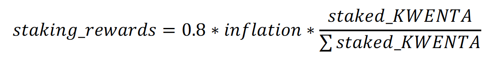
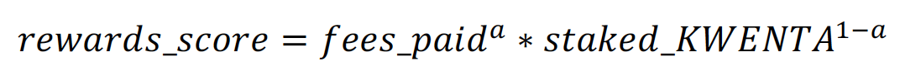
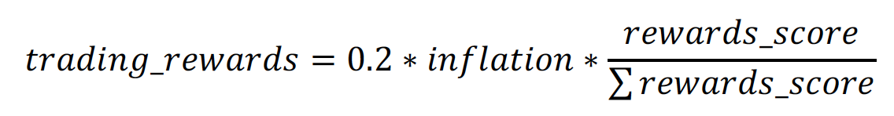

## Summary

This proposal outlines a staking mechanism for the Kwenta DAO.

## Abstract

The Kwenta staking system will have two primary functions:

1. Governance: staked KWENTA will gain voting power within the system enabling stakers to vote in elections and CKIPs offering the protocol a decentralized decision making mechanism.
2. Protocol Rewards: Staked KWENTA will earn inflationary rewards. This mechanism will empower members dedicated to the protocol to increase their influence over decision making. Additionally, staked wallets that have trading activity will earn additional rewards in an effort to place active Kwenta users at the center of decision making.

## Motivation

Having a decentralized decision making process is crucial for an unstoppable protocol. After examining the success of the decision making processes in protocols such as Synthetix and Yearn, we designed a mechanism that not only distributes decision making across community members but also adequately incentivizes them to continue to make decisions that are beneficial for the protocol.

## Specification

Core Contributors will develop a staking portal which will enable KWENTA holders to easily vote and earn rewards with their tokens. Kwenta stakers will receive inflationary rewards as a way to route voting power to those that demonstrate commitment to the project. This will also equip the Kwenta community with a system that can be expanded upon should the community decide, via a KIP approved by the Elite Council, to build KWENTA into a productive asset.

Inflationary rewards are distributed continuously to stakers based on two factors: amount of Kwenta staked and trading activity.

The inflationary rewards will be split into two types of rewards: pure inflationary rewards and trading rewards (determined by a trading score). This proposal recommends allocating 80% of inflation to the pure inflationary (𝜌) rewards. This will enable the treasury and growth fund, when staked, to retain a proportion of the supply, better preparing the protocol to operate sustainably and provide additional incentives for trading, DAO roles, marketing, etc.

The remaining 20% of inflation will be distributed to KWENTA stakers according to a
rewards score that is a function of staking participation and trading activity. The rewards
score will be a Cobb-Douglas function with exponential weighting (that ideally will favor
trading activity):

It’s important to note that 𝑓𝑒𝑒𝑠*𝑝𝑎𝑖𝑑 is used here rather than 𝑡𝑟𝑎𝑑𝑖𝑛𝑔*𝑣𝑜𝑙𝑢𝑚𝑒 to prevent
abuse. Since different markets will have lower fees than others (e.g. FOREX markets
may have extremely low fees), malicious stakers may inflate their rewards by trading
large volumes in low fee markets. Using 𝑓𝑒𝑒𝑠_𝑝𝑎𝑖𝑑 levels the playing field for all stakers.

An individual staker’s trading rewards are then evaluated as:

Configurable Values

• 𝜌 – share of inflation allocated to pure staking rewards (default = 0.8)

• 𝑎 – weight applied to 𝑓𝑒𝑒𝑠*𝑝𝑎𝑖𝑑 in 𝑟𝑒𝑤𝑎𝑟𝑑𝑠*𝑠𝑐𝑜𝑟𝑒 calculation (default = 0.7)

Inflationary KWENTA rewards are locked for a period of 1 year but will have transferability so that the protocol can redirect inflationary rewards earned from the growth fund and treasury as needed. Once the one year vesting period is complete, KWENTA can be withdrawn from the staking portal and freely used at the stakers’ discretion. KWENTA rewards that are vesting can be staked to increase voting power and weekly rewards.

Staking will only be available on Layer 2 Kwenta.

## Copyright

Copyright and related rights waived via [CC0](https://creativecommons.org/publicdomain/zero/1.0/).
