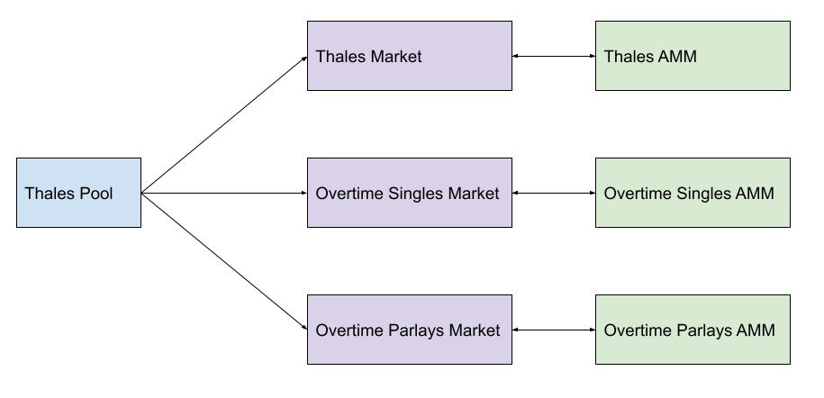

<!--You can leave these HTML comments in your merged SCCP and delete the visible duplicate text guides, they will not appear and may be helpful to refer to if you edit it again. This is the suggested template for new SCCPs. Note that an SCCP number will be assigned by an editor. When opening a pull request to submit your SCCP, please use an abbreviated title in the filename, `sccp-draft_title_abbrev.md`. The title should be 44 characters or less.-->

## Simple Summary

<!--"If you can't explain it simply, you don't understand it well enough." Provide a simplified and layman-accessible explanation of the SCCP.-->

Create a Thales Pool and register three Markets on Synthetix v3, enabling SNX LPs to gain exposure to Thales and Overtime AMMs and their respective yields.

## Abstract

<!--A short (~200 word) description of the variable change proposed.-->

Create a new v3 Pool, “Thales Pool”, controlled by Thales treasury, in line with [SIP-302](https://sips.synthetix.io/sips/sip-302/):  
- `createPool(7,[ThalesPoolOwnerAddress])`
- `setPoolName(7, “Thales Pool”)`

Register three new v3 Markets, “Thales Market”, "Overtime Singles Market" and "Overtime Parlays Market" to be collateralized by the Thales Pool:
- `registerMarket([addressOfNewThalesMarket])`
- `registerMarket([addressOfNewOvertimeSinglesMarket])`
- `registerMarket([addressOfNewOvertimeParlayssMarket])`
- `setMarketMinDelegateTime` = 2 weeks
- `minimumCredit` = capital utilization rate of underlying AMM * amount deposited to the AMM by the v3 market

Each of the three Markets will leverage sUSD credit against the Thales Pool collateral, desposit it into the underlying AMMs as LP positions, and periodically distribute yields or losses back to the Thales Pool.

## Motivation

<!--The motivation is critical for SCCPs that want to update variables within Synthetix. It should clearly explain why the existing variable is not incentive aligned. SCCP submissions without sufficient motivation may be rejected outright.-->

The proposal aims to connect Synthetix v3 LPs with Thales and Overtime AMMs, which have demonstrated strong historical yields:

- Thales AMM: 9.27% lifetime yield over 16 weeks
- Overtime Singles AMM: +51.89% lifetime yield over 25 weeks
- Overtime Parlays AMM: 7.89% lifetime yield over 11 weeks

The Thales Pool will be configured to delegate collateral to the three Markets. The three Markets will act as intermediaries, drawing from the Thales Pool and distributing collateral to the respective Thales and Overtime AMMs. This setup will mitigate front-running risks by exposing collateral to all Thales and Overtime AMMs.

At any given time, a keeper can invoke a `rebalance` function to:

- Assess credit capacity delta and signal deposit or withdrawal intentions to the Thales or Overtime AMMs.
- Collect yields, withdraw from Thales and Overtime AMMs, invoke `depositMarketUsd` on the v3 core system, and deposit the yields to the Thales Pool.

## Copyright

Copyright and related rights waived via [CC0](https://creativecommons.org/publicdomain/zero/1.0/).
