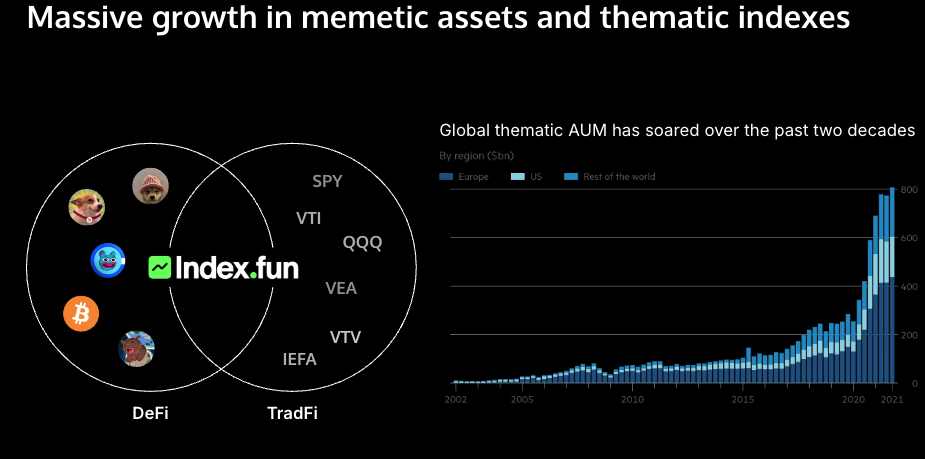

# Simple Summary

<a href="https://truflation.com/marketplace/hedge-index" rel="noopener noreferrer" target="_blank">HEDGE Index</a> as a tradeable product&nbsp; on Arbitrum with the underlying assets as well 

# Abstract

This proposal is to offer HEDGE-PERP futures which tracks the price of the Truflation HEDGE Index

# Specification

### Overview

N/A

### Rationale

The <a href="https://truflation.com/marketplace/hedge-index" rel="noopener noreferrer" target="_blank">Truflation Hedge Index</a> is an investment index that is selected to reduce the potential for loss from inflation given the rise in the cost of goods and services. As inflation is a global concern, the ability to protect against it is in increasingly high demand. By providing HEDGE as a tradeable PERP, traditional and crypto investors will be able to both hedge their portfolios as well as trade on the prediction of the direction of the Index itself.

 

Index coins combine the cultural movement of memetic assets with the market for thematic indexes.

 

 

Thematic indexes represents om $800B in AUM in traditional finance. These indexes take years to obtain approval and cost a minimum of $1/2M to create. At the same time pump.fun is making $22M/month.&nbsp;At the same time, Memetic assets have reached a <a href="https://www.coingecko.com/en/categories/meme-token" rel="noopener noreferrer" target="_blank">market cap of $73B with 24h trading volume of $18B</a>.

 

We see indexcoins reaching a $500B market cap with some $100B in daily trading volumes by the end of this decade.&nbsp;

 

Given the attention to Inflation and the desire for $HEDGE products to protect liquid assets against inflation, we are targeting a $7M daily trading volume for the $HEDGE product.&nbsp;&nbsp;

 

### Test Cases

N/A

### Configurable Values (Via SCCP)

<ul><li>Chainlink Verifier</li><li>Chainlink Data streams</li><li class="ql-indent-1">Stream ID</li><li class="ql-indent-1">Weights</li><li>Index configuration</li><li class="ql-indent-1">Next update</li><li class="ql-indent-1">Update frequency</li></ul>