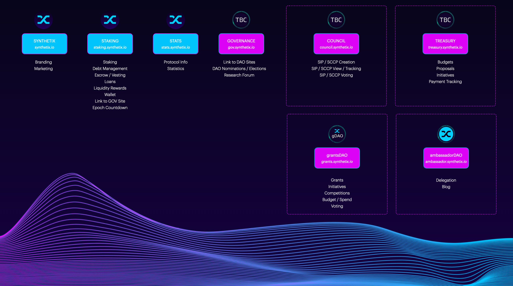

<!--You can leave these HTML comments in your merged SIP and delete the visible duplicate text guides, they will not appear and may be helpful to refer to if you edit it again. This is the suggested template for new SIPs. Note that an SIP number will be assigned by an editor. When opening a pull request to submit your SIP, please use an abbreviated title in the filename, `sip-draft_title_abbrev.md`. The title should be 44 characters or less.-->

# Simple Summary

This proposal seeks to introduce a new meta-governance dApp to simplify the meta-governance processes of the Synthetix Governance System and addresses current meta-governance edge-cases and frictions.

<!--A short (~200 word) description of the proposed change, the abstract should clearly describe the proposed change. This is what *will* be done if the SIP is implemented, not *why* it should be done or *how* it will be done. If the SIP proposes deploying a new contract, write, "we propose to deploy a new contract that will do x".-->

# Abstract

If this SIP is approved and adopted, the following will be implemented

- A new meta-governance dApp for the elections and nominations of the DAOs
- Formalise the ownership and responsibilities of the governance structures in relation to their dApps, contracts and auxiliary material
- Formalising the differences between a Decentralised Autonomous Organisation (DAO), Council & Committee
- Specify formal proceedings and timelines for the election and nomination process
- Address meta-governance edge-cases with specific processes

<!--This is the problem statement. This is the *why* of the SIP. It should clearly explain *why* the current state of the protocol is inadequate.  It is critical that you explain *why* the change is needed, if the SIP proposes changing how something is calculated, you must address *why* the current calculation is inaccurate or wrong. This is not the place to describe how the SIP will address the issue!-->

# Motivation

Since the introduction of [SIP-93](https://sips.synthetix.io/sips/sip-93) which ratified the Spartan Council and paved the way for the establishment of the grantsDAO and ambassadorDAO. The governance system has unveiled meta-governance edge-cases and frictions that have been historically solved by experimentation and discretion.

To reduce disparity in the governing bodies and to allow them to operate effectively it is important that the meta-governance processes are reviewed and evolve over time.

# Specification

<!--The specification should describe the syntax and semantics of any new feature, there are five sections
1. Overview
2. Rationale
3. Technical Specification
4. Test Cases
5. Configurable Values
-->

Table of Topics:

1. [Defining the different types of bodies](#Defining-the-different-types-of-governing-bodies)
1. [Metagovernance dApp](#Metagovernance-dApp)
1. [Staking dApp Governance](#Staking-dApp-Governance)
1. [Meta-Governance Processes](#Meta-Governance-Processes)

### Defining the different types of governing bodies

#### Overview

The current Synthetix Governing Bodies are:

- Spartan Council
- grantsDAO
- ambassadorDAO
- synthetixDAO

The upcoming bodies (as of writing this) are:

- Treasury Council
- Risk Committee
- Core Contributor Committee

Most of the bodies have been labeled (DAO vs Committee vs Council) on an ad-hoc basis which have caused some confusion over the difference between the bodies. This section aims to formalize the definitions and renames some of the previous bodies accordingly.

#### Rationale

With the introduction of more new bodies that handle different aspects of the protocol, it has become apparent that the labeling of governing bodies becomes systematic to help the community understand the differences between the bodies.

#### Technical Specification

This section of the SIP proposes to:

- Label the collective governing bodies as the _Synthetix DAOs_
- Label all the bodies in which token holders delegate to (via a direct vote) as a _Council_
- Label all the bodies in which the internal stakeholders nominate as a _Committee_

_Synthetix DAO_

The label that comprises all the existing and future bodies under the Synthetix Governance system. It is an umbrella term to describe all the bodies and its ecosystem.

_Council_

The label given to bodies that represent members who are elected by the token holders, these responsibilities will be accompanied by on-chain execution privileges.

_Committee_

The label given to bodies that represent members nominated by internal stake-holders, they are usually created to help bring over-sight and accountability to another internal structure.

#### Test Cases/Examples

_Committee_

There are 420,69 SIPs that have been sitting in the SIPs repo for more than a month with different statuses. The Core Contributors are too busy working on existing SIPs to look at the upcoming SIPs.

A new governing body is proposed to help manage the editing, approval and scheduling of SIPs/SCCPs, the individuals who are selected are to be picked out of the Core Contributor engineers. Since this is an internal process composed of internal stakeholders it is labeled the SIP Committee

_Council_

After the tapering of inflation, the community has an outcry to introduce a burning mechanism in the system. The community is finding it difficult to make a decision on the amount of $SNX to burn.

They propose to introduce a new body in which the community will vote in every 3 months, they are responsible for rolling a dice every week, where the number represents the percentage in which to burn that weeks inflation rewards by (0-6).

This body would be labeled the Burning Man Council.

### Metagovernance dApp

#### Overview

The introduction of a Metagovernance dApp which focuses on building infrastructure to carry out self-nominations and house nominee profiles and elections aims to further automate the election process whilst helping voters make more informed decisions when voting for critical components of the Synthetix Governance System (DAOs).

#### Rationale

There has been significant friction in the nomination and election processes carried out every epoch in which members are voted in by the Synthetix Token holders to serve in their respective DAOs.

In the current process of nominations, there is a high-level of centralization and friction, requiring Core Contributors to monitor the Discord channels and nominees (wallet address and discord identities) to a [Google Spreadsheet](https://docs.google.com/spreadsheets/d/1nbAUAioVvxlhtBzUI0dwmedGC2R3AZL-mDws7BzvZDQ/edit?usp=sharing). This presents several attack vectors including:

1. Not being censorship resistant
2. High chance of human error (forgetting or missing discord messages)
3. Not being immutable (spreadsheets can be changed by admins)

The election process is also very fragile where voters are not well-informed and cannot easily access information relevant (nomination campaigns/pitches and voting history) to voters when making a critical decision. The process currently has a high-level of technical overhead requiring Core Contributor engineers to manually match wallet addresses to discord identities in the proposal to alleviate some voting friction.

#### Technical Specification

A new frontend will be designed and developed which encapsulates the nomination and election processes for all the Synthetix Community elected DAOs.

As of writing this includes the:

- Spartan Council
- Treasury Council
- ambassadorDAO
- grantsDAO

Apart from the design which will be conducted by a Core Contributor, the dApp will be closely developed with the following projects:

- [Collab.Land](https://collab.land/)
- [Ceramic Network](https://ceramic.network/)
- [Snapshot](https://docs.snapshot.org/)

**_Collab.Land_**

Collab.Land will be providing infrastructure for the dApp login/registration process, allowing for users to link a discord identity to a wallet address and vice-versa. The Synthetix Discord server will also receive power-ups including: in-channel voting and notifications.

**_Ceramic Network_**

The Ceramic Network Protocol will be built on-top of the identities generated by Collab.Land, empowering users to create profiles for their wallet/identities which will be used for creating election pitches/campaigns.

**_Snapshot_**

The Synthetix Governance system heavy relies on Snapshot's gas-less voting infrastructure, we will continue to use this system but take steps to further simplify and automate the process with the addition of the identity features above.

#### Test Cases/Examples

_Linking a wallet to discord_

A user visits the meta-governance dApp, they connect their wallet via [onboard.js](https://docs.blocknative.com/onboard). If they have not linked their currently selected wallet to an identity there will be a prompt to do so.

Using Collab.Land infrastructure, a custom authentication flow will allow the user to connect their wallet to a discord identity (via signatures). This will be stored and used throughout the dApp.

_Editing a wallet profile_

When a user has connected to the meta-governance dApp, they can visit their wallet profile page. This page will feature important governance statistics, activity and content hosted by Ceramic.Network.

A user can prove that they own the current wallet via a signature which then allows them to edit bio/pitches and other front-facing details and publish it.

_Nomination Process_

When the nomination period is open, users who are connected to a wallet are able to nominate themselves for a particular DAO. They do this via a signature with their wallet. Candidates will no longer be automatically carried over for nomination from one epoch to the next.

The dApp will be able to make use of their connected discord identity to help display the nominees in a familiar way.

All nominees are required to fill in their pitch to be displayed during the election process.

_Election Process_

When the election starts, any user can browse the current elections that are running. Here they can see the nominees for each DAO and explore their pitches, profiles and voting histories.

A connected user is then able to vote via snapshot on the election.

### Staking dApp Governance

#### Overview

Redesign and incorporate the new meta-governance features into the staking dApp replacing the current governance flow.

#### Rationale

Historically the only two places the elections were being surfaced to users were the

1. Staking dApp
2. Directly on snapshot

With the introduction of the third method being the meta-governance dApp, it is still important that the elections are still accessible within the staking dApp as this is still the main destination of the Synthetix stakeholders (due to weekly rewards and debt management), ensuring that the voting of elections is low-friction and the voter engagement remains high.

With the new infrastructure being introduced to the meta-governance dApp, it is a suitable time to rework the flow in the Staking dApp to further improve this process.

#### Technical Specification

**_Rework Governance Section Positioning_**

The Governance Section should be surfaced on the landing page of the dApp (along side the available user actions) as its a essential responsibility of the Synthetix Stakers.

This dedicated section will be the main object returning users will see, and show important notification/information messages as well as link out to the meta-governance dApp where they can explore more.

**_Quick Vote Function_**

During an election period, Synthetix Stakers are required to vote before they can claim their rewards. A quick vote function will be integrated within the claiming rewards such that it is low-friction.

#### Test Cases/Examples

TBD

### Meta-Governance Processes

#### Overview

This section attempts to address the most prevalent problems and edge-cases in the meta-governing of the DAOs.

#### Rationale

_The DAOs govern specific responsibilities in their domain, but who governs the DAOs?_

The answer to this is complex, on one hand it might be the Synthetix Token Voters who signal how a DAO should operate based on their who they elect and on the other hand it might be the Treasury Council who provide the stipends and incentives for the DAOs to operate.

In both cases, DAOs require some sort of guidance in their meta-governance processes to maintain consistency + accountability in their actions and this section attempts to voice the community and DAO concerns by addressing some of the uncertainty in some critical actions.

This section is by no-means final and processes should be revisited redefined with the reiteration of Synthetix Governance via meta-governance SIPs (a new sub-category of SIPs that require unanimous votes by the SC).

#### Specification

**_Election & Nomination Timeline_**

**T -4 weeks:**

- `T -4 weeks Day 1`
  - Automated system-wide notification / information message\* (A general message stating that the Epoch is nearing its end).

**T -3 weeks:**

- `T -3 weeks Day 1`
  - Automated system-wide notification / information message\* (To signify the opening of nominations).
  - Automatically open up the nominations features on the meta-governance dApp - allowing users to nominate themselves for a specific DAO.
  - Auto-post new nomination registrations (profile & pitches) to a dedicated, read-only Discord channel.
- `T -3 weeks Day 7`
  - Auto-close nominations on the meta-governance dApp.
  - Schedule an election for each DAO on snapshot with the nominees.

**T -2 weeks:**

- `T -2 weeks Day 1`
  - Automated system-wide notification / information message\* (To announce that the nominations are closed and voting has started).
  - Voting starts on the election proposals.
- `T -2 weeks Day 14`
  - Voting ends on the election proposals.

**T = 0:**

- `T Day 0`
  - Automated system-wide notification / information message\* (To announce the start of a new governance epoch).
  - Publish the voting results in discord and socials.
  - Auto assign new Discord roles, where applicable.
  - DAOs then initiate their Handover Processes\*\*, if new members join.

\*_Staking dApp, Gov Website, Discord, Twitter_

_\*\*Handover Processes defined below_

**_DAO Responsibilities_**

_Technical & Resourcing_

Each DAO and Council will be responsible for the maintenance and management of their dApps, social media, auxiliary tools and smart contracts. It is important that the DAOs utilise the #all-daos channel to knowledge share.

Funding and resourcing for website & smart contract design, development and maintenance can be requested from the `grantsDAO`.

Funding and payment for 3rd party software need to be submitted to the `Treasury Council` for approval.

In regards to meta-governance smart-contracts, dApps and resourcing this will be the responsibility of the Core Contributors and the Core Contributor Committee.

_Handover Process_

The intent of this SIP is not to inform the Councils and DAOs on how to manage their internal Handover Process, only to ensure that they are accountable for fulfilling & managing this process.

Critical elements of the Handover Process includes:

- Internal operating procedures
- Transfer and management of multi-sig owners
- Transferring access to DAO socials (i.e Discord & Twitter) and tools.

#### Test Cases/Examples

The intent is to clarify the process to follow during abnormal situations outside of the normal operating procedures. We will present this in the form of an Q&A:

> **Q:** Can someone from the community nominate another person on their behalf?
>
> **A:** No. The community can signal their support for someone to nominate for a DAO but an individual can only nominate themselves via the meta-governance dApp.

> **Q:** What happens when a nominated user wants to withdraw during the voting period?
>
> **A:** The nominee must inform the community in ample time to allow the voters to reallocate their votes.

> **Q:** What happens when a nominated user rejects their seat after the voting period?
>
> **A:** The next runner-up in the finalized election will be automatically appointed in the place of this individual, if there is no runner-up then the Stand-In Procedure applies.

> **Q:** What is the Stand-In Procedure?
>
> **A:** The DAO in question approaches other DAOs to see if one of their elected members can help supplement the missing role. If other DAOs are not willing/unable to support, the Core Contributors can be called upon to help. The supplementary role may be paid a stipend at a different rate at the discretion of the Treasury Council.

> **Q:** What happens when a appointed member resigns their position some time during the current EPOCH?
>
> **A:** The next runner-up is appointed, if there is no runner-up the Stand-In Procedure applies.

> **Q:** What happens when there are not enough candidates to fill all the required positions in a DAO or Council for a specific EPOCH?
>
> **A:** The Stand-In Procedure applies

> **Q:** What happens when a DAO member refuses to transfer their NFT?
>
> **A:** The protocolDAO (soon to be deprecated) is the only one that can control the movement of the NFTs, once the protocolDAO is deprecated another suitable entity will be assigned as the controller.

> **Q:** What happens when there are not enough candidates to fill all the required positions in a DAO or Council for a specific EPOCH?
>
> **A:** The Stand-In Procedure applies

> **Q:** What happens when there are less nominees then there are positions?
>
> **A:** The Stand-In Procedure applies

> **Q:** What is the fallback plan for DAOs with less than 5 owners?
>
> **A:** All DAOs with less than 5 signers should appoint a backup signer from one of the other DAOs in order to mitigate the chance that there are not enough available signers at given time.

# Copyright

Copyright and related rights waived via [CC0](https://creativecommons.org/publicdomain/zero/1.0/).
