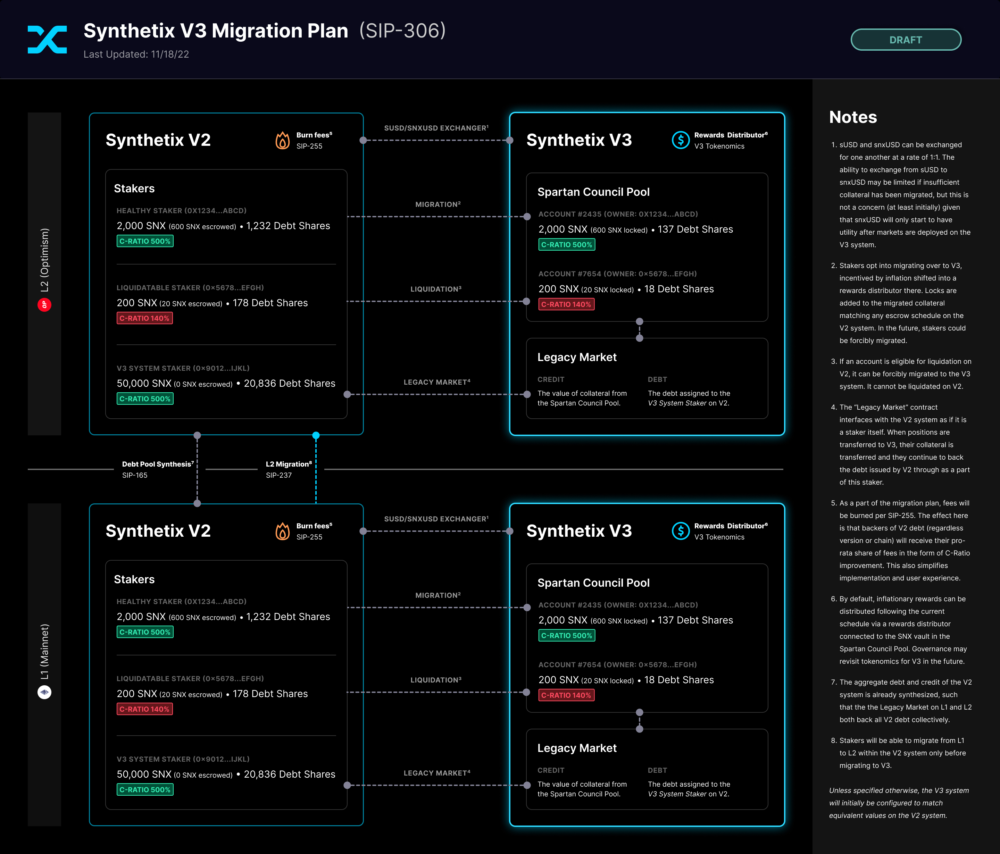

<!--You can leave these HTML comments in your merged SIP and delete the visible duplicate text guides, they will not appear and may be helpful to refer to if you edit it again. This is the suggested template for new SIPs. Note that an SIP number will be assigned by an editor. When opening a pull request to submit your SIP, please use an abbreviated title in the filename, `sip-draft_title_abbrev.md`. The title should be 44 characters or less.-->

## Simple Summary

<!--"If you can't explain it simply, you don't understand it well enough." Simply describe the outcome the proposed changes intends to achieve. This should be non-technical and accessible to a casual community member.-->

This SIP proposes a migration plan for Version 3 of the Synthetix protocol. Collateral will be migrated to V3 and account tokens will be minted to existing stakers’ addresses. These stakers will continue to back all debt issued by V2X.

## Abstract

<!--A short (~200 word) description of the proposed change, the abstract should clearly describe the proposed change. This is what *will* be done if the SIP is implemented, not *why* it should be done or *how* it will be done. If the SIP proposes deploying a new contract, write, "we propose to deploy a new contract that will do x".-->

The migration will allow stakers on V2X to move their collateral to V3 and receive an account token with a staking position that backs a special _Legacy Market_. The Legacy Market will appear to the V2X system as a staker. It will also be able to convert stablecoins issued from V2X (sUSD) into stablecoins issued by V3 (snxUSD). Migrated escrowed SNX will be locked with an equivalent schedule in the V3 system.

## Motivation

<!--This is the problem statement. This is the *why* of the SIP. It should clearly explain *why* the current state of the protocol is inadequate.  It is critical that you explain *why* the change is needed, if the SIP proposes changing how something is calculated, you must address *why* the current calculation is innaccurate or wrong. This is not the place to describe how the SIP will address the issue!-->

The primary goal of this plan is to minimize friction for stakers and to avoid disrupting the current usage of synths while allowing the system to benefit from the upgrade to V3. This is also a relatively simple migration path, which reduces risk and expedites deployment.

This plan also allows us to migrate to V2X and V3 while being agnostic to cross-chain considerations. Because we can deploy V3 with a Legacy Market on both L1 and L2 and the [debt pool synthesis](https://sips.synthetix.io/sips/sip-165/) can continue to be utilized, the V2X debt on both networks can be backed by collateral the V3 system on either or both networks. Cross-chain migration of collateral (staking positions) and debt (snxUSD) for V3 will be proposed in forthcoming SIPs.

This plan is also agnostic to rewards and escrow/locking. If [SIP-276](https://sips.synthetix.io/sips/sip-276/) is implemented and locking/escrow is not necessary in [SIP-305](https://sips.synthetix.io/sips/sip-305/), stakers should be able to retrieve escrowed SNX from the existing contracts. Otherwise, a proposal for the migration of escrowed SNX into a new escrow system for V3 may be proposed.

Further, the migrate function specified in the Legacy Market can initially only be invoked by the relevant staker. In the future, we could add an incentive for users to migrate and eventually the function could be made public in the future. This would allow a script to forcibly migrate all V2X staking positions to completely end use of the contracts in the V2X being replaced by V3.

## Specification

<!--The specification should describe the syntax and semantics of any new feature, there are five sections
1. Overview
2. Rationale
3. Technical Specification
4. Test Cases
5. Configurable Values
-->

### Overview

<!--This is a high level overview of *how* the SIP will solve the problem. The overview should clearly describe how the new feature will be implemented.-->

The plan proposed here involves the creation of a _Legacy Market_ contract. See [SIP-299](https://sips.synthetix.io/sips/sip-299/) for prerequisite updates to the V2X protocol.



### Rationale

<!--This is where you explain the reasoning behind how you propose to solve the problem. Why did you propose to implement the change in this way, what were the considerations and trade-offs. The rationale fleshes out what motivated the design and why particular design decisions were made. It should describe alternate designs that were considered and related work. The rationale may also provide evidence of consensus within the community, and should discuss important objections or concerns raised during discussion.-->

We’ve considered multiple other migration plans in relation to the one proposed here. The main alternative would involve a “clean break” from V2X, where all stakers and synth holders would need to voluntarily exit the existing system and opt into V3. There any many downsides to this approach: all users and ecosystem partners would be required to actively migrate; there would be an indefinite maintenance period for V2X; we would have multiple versions of the protocol’s tokens in circulation at once; there would be a risk of the synths issued by V2X losing their backing; there could become a higher risk of liquidation for stakers on V2X; and, there would be a higher risk of lost TVL and revenue.

Another plan we considered would entail rebuilding all aspects of the protocol for V3, updating all of the existing tokens—including synths—such that V3 can mint and burn them, and then running a migration script to generate V3 accounts and staking positions. While this would be non-disruptive to users, it would require us to determine how the market contracts and all of the auxiliary features of V2X (wrappers, loans, cross-chain synthesis, etc.) will be handled by V3 prior to initiating the migration.

Instead, the plan proposed here is similar to the second option above, but allows us to execute it in multiple steps. The “legacy” market contract will allow V3 to back the existing synths and support the auxilary features of the system. This way, we can start by providing the benefits of V3 to stakers (improved systems for collateral management, liquidations, staking incentives, etc.) prior to upgrading how synths are implemented and auxiliary features.

### Technical Specification

<!--The technical specification should outline the public API of the changes proposed. That is, changes to any of the interfaces Synthetix currently exposes or the creations of new ones.-->

This migration will involve making some upgrades to V2X and deploying a Legacy Market Contract on V3.

All of the smart contracts pertaining to synths, perps, wrappers, loans, and shorts can be left as-is. They can be deprecated and/or migrated in the future.

**“Legacy” Market Contract**

The following pseudo-code outlines the necessary functions in the Legacy Market contract:

```solidity
contract LegacyMarket is IMarket {

  function balance() external returns (uint) {
    return synthetixV2.totalIssuedSynths()
  }

  function migrate(address staker) external {
    require(msg.sender == staker);
    uint accountId = synthetixV3.createAccount();
    synthetixDebtShares.transferFrom(staker, address(this), synthetixDebtShares.balanceOf(staker));
    snxToken.transferFrom(address(synthetixV2), address(synthetixV3), snxToken.balanceOf( staker));
    synthetixV3.delegateCollatera(/* preferred fund, leverage 1, etc. */)
    _applyApproximateCurveFromEscrowEntry(accountId, staker); // Note that this contract temporarily needs elevated permissions to execute this function.
    snxAccount.transfer(accountId, staker);
  }

  function convertUsd(uint amount) external {
    synthetixV2.burn(msg.sender, amount);
    synthetixV3.mint(msg.sender, amount);
  }

}
```

In the future, it would be possible to execute a script to force migrate users from V2X to V3. At this, all staking positions would be migrated to V3, and all positions will providing liquidity to the legacy markets by default. (This means existing integrations of Synths, such as Curve, will not be disrupted.) Once this migration has occurred it will be possible to deprecate individual synths and features over time as specific migration plans are developed.

### Test Cases

<!--Test cases for an implementation are mandatory for SIPs but can be included with the implementation..-->

Relevant tests will be developed during implementation.

### Configurable Values (Via SCCP)

N/A

## Copyright

Copyright and related rights waived via [CC0](https://creativecommons.org/publicdomain/zero/1.0/).
