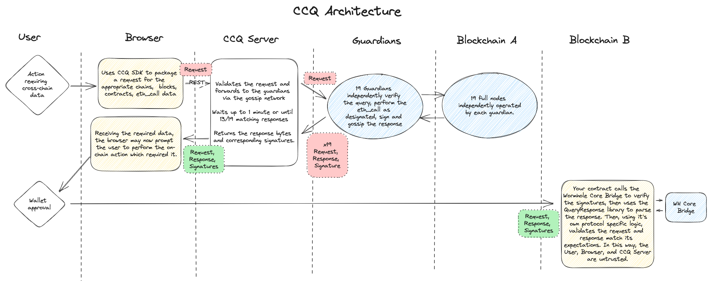
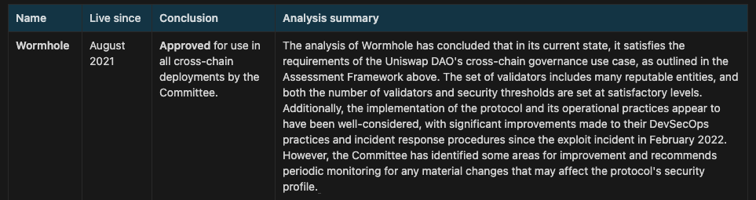

## Simple Summary
<!--Provide a simplified and layman-accessible explanation of the SIP.-->

Enable crosschain reads on Synthetix V3, by integrating Wormhole's CrossChain Query (CCQ). Synthetix is approaching a multichain future, and needs a robust, generalized crosschain read capability for many chains and appchains. If approved, Wormhole CCQ will be implemented, enabling proposals like [SIP-312](https://sips.synthetix.io/sips/sip-312/) unlocking a multichain future for Synthetix V3.

## Abstract
<!--A short description of the issue being addressed.-->

This SIP proposes integration of crosschain reads via Wormhole's CCQ, which allows any EVM chain function within the Wormhole ecosystem to be queried offchain, and verified by a 2/3 supermajority of its 19 Guardians. Wormhole's oracle conforms to EIP-7412 and for example, enables crosschain pool synthesis proposed in SIP-312. For a demonstration crosschain pool across Ethereum, Optimism and Arbitrum, Synthetix could use CCQ to get pool data from two chains, to update the system on the third chain. While Synthetix is currently exploring isolated deployments, these deployments will likely need to be unified in the future.

## Motivation
<!--This is the problem statement. This is the *why* of the SIP. It should clearly explain *why* the current state of the protocol is inadequate.  It is critical that you explain *why* the change is needed, if the SIP proposes changing how something is calculated, you must address *why* the current calculation is inaccurate or wrong. This is not the place to describe how the SIP will address the issue!-->

There is no generalized solution for secure and efficient crosschain data queries, and the current Synthetix v2 oracle is not scalable for the arbitrary number of chains and data in Synthetix V3. Secure crosschain messaging is a requirement for the draft SIP-312, as well as any synthesized multichain future or appchain. Secure, generalized crosschain messaging is infrastructure that Synthetix requires, and unlocks up multiple potential future configurations of the protocol.

## Specification
<!--Describe the syntax and semantics of any new feature.-->
### Overview
<!--This is a high level overview of *how* the SIP will solve the problem. The overview should clearly describe how the new feature will be implemented.-->
CCQ provides a mechanism to request information, and receive an attestation from the Wormhole Guardians, about a chain they are connected to. This can be thought of as the “pull” equivalent to calling `publishMessage` on the core bridge (”push”).

Currently, the specification details 3 types of requests:

1. `eth_call` allows performing an arbitrary batch of [eth_call](https://ethereum.org/en/developers/docs/apis/json-rpc/#eth_call) requests against a block by height or hash
2. `eth_call_by_timestamp` provides the same functionality, but based on a timestamp where the guardians enforce that the queried block and following block are `1` different and their timestamps must be such that the target block is *before* the target time (inclusive) and the following block is *after* (exclusive).
3. `eth_call_with_finality` similar to `eth_call` but ensures that the specified block has reached the specified finality before returning the query results. The finality may be `finalized` or `safe`.

Requests can be issued via a REST service (called a CCQ Server or CCQ Proxy) which forwards the requests to the guardians via gossip and aggregates the responses. A [Solidity SDK](https://github.com/wormhole-foundation/wormhole/blob/main/ethereum/contracts/query/QueryResponse.sol) is available for parsing responses on-chain along with a [TypeScript SDK](https://www.npmjs.com/package/@wormhole-foundation/wormhole-query-sdk) for forming queries and mock testing. More details in [the CCQ whitepaper](https://github.com/wormhole-foundation/wormhole/blob/main/whitepapers/0013_ccq.md).

### Technical Specification
<!--The technical specification should outline the public API of the changes proposed. That is, changes to any of the interfaces Synthetix currently exposes or the creations of new ones.-->
Enabling Wormhole's CCQ oracles involves the following steps:

1. Implement the standard by reverting with `error OracleDataRequired(address oracleContract, bytes oracleQuery)`.
2. Clients query the specified decentralized oracle network for signed data.
3. Stage a transaction with a multicall that prepends the verification of the required cross-chain data.
4. Write the data on-chain during verification for the subsequent call to read.

#### Example implementation (Crosschain Pool Synthesis from SIP-312)

**Using a protocol-provided endpoint / service (off-chain)**

A Synthetix user wants to borrow sUSD on Arbitrum, against their SNX staked on Synthetix Chain:

1. Clicks button on Arbitrum UI, hits protocol REST endpoint.
2. Endpoint signs request for latest Arbitrum block and `eth_call_by_timestamp` to their deposit contract `getLockedAssets(addr, token)` and gossips it.
3. Guardians receive the request, make the call to Synthetix Chain, sign and gossip the response.
4. Endpoint gathers enough signatures for quorum (at least 13 of 19), returns status `200` with the response bytes and signatures.
5. User is prompted to submit the resulting response and signatures to the borrow contract on Arbitrum.
6. The contract verifies the signatures with the core bridge contract, checks the request data was for the correct chain, contract, and call data, then abi decodes the result.

**Note that reading the latest block has a risk of it not being finalized. The protocol will need to determine what level of risk is acceptable or how to mitigate this risk.*

The number of steps that the user has to perform will be the same for cross chain pools as for non-cross chain for most operations. However, in certain situations, a timelock may be required before the user is able to take their next operation, or before their change has had full effect due to the latency of sending to/receiving from other chains. 

For example, if the user wants to mint USD, there will be no choice but to wait for a minimum timelock of a few minutes while the data about their withdrawal propagates to other chains. However, if the user is newly delegating collateral, there is no additional step, the process is the same. For pool owners, when `setPoolConfiguration` is called, the pool configuration is only *partially* applied initially, and the rest if applied after a few minutes. Erc7412 introduces some latency on the browser side (which we have already seen with pyth oracles). However, this latency has been demonstrated to be totally manageable and do not seem to be harmful to UX.

[A Proof of Concept](https://github.com/Synthetixio/synthetix-v3/tree/xchain-pools) shows it is possible to create a Synthetix V3 pool and then synchronize its state across chains.

### Rationale
<!--Describe what motivated the design and why particular design decisions were made.-->

Synthetix core contributors have proposed EIP-7412 as the optimal standard for crosschain reads, and Wormhole has implemented CCQ to be conformant. The integration of Wormhole's implementation offers the advantage of:

- A mechanism for initiating requests on-chain and off-chain, and for responses
- A generic, extensible solution for describing requests and responses
- A form of request replay-protection and DoS mitigation
- A format for serialization and support for batch query requests

#### Wormhole

Wormhole is an open and decentralized interoperability protocol, with all security controls fully transparent to end users. It operates a 13 of 19 Guardian set for message validation and governance, run by separate legal entities geographically dispersed throughout the world - North America, Europe, Asia, and South America. More can be found about Wormhole’s security [here](https://github.com/wormhole-foundation/wormhole/blob/main/SECURITY.md). 

[Uniswap](https://www.notion.so/0c8477afadce425abac9c0bd175ca382?pvs=21) conducted an independent assessment that examined Wormhole’s trust, decentralization, and security against major bridge competitors. Wormhole was determined to be the most secure option for all of Uniswaps use cases, and the only bridge approved for deployment without any preconditions. See the specific [Wormhole Report](https://www.notion.so/dac583c6db1240c7b9d294afd7f18035?pvs=21) and the [Uniswap Bridge Assessment](https://www.notion.so/0c8477afadce425abac9c0bd175ca382?pvs=21)

There was a Wormhole hack in February 2022, and all lost funds were subsequently reimbursed within 16 hours - see the [incident report](https://wormholecrypto.medium.com/wormhole-incident-report-02-02-22-ad9b8f21eec6). Since then, as the Uniswap Bridge Committee notes in their summary above, Wormhole has made significant improvements and has:

- Developed one of the most robust security programs in the industry - see the year-end report [here](https://wormholecrypto.medium.com/wormhole-security-program-end-of-year-update-212116ecfb91).
- Launched [The Governor](https://github.com/wormhole-foundation/wormhole/blob/main/whitepapers/0007_governor.md) - Limit the impact of certain exploits by giving Guardians the option to delay Wormhole messages from registered token bridges if their aggregate notional value is extraordinarily large.
- Launched [The Global Accountant](https://github.com/wormhole-foundation/wormhole/blob/main/whitepapers/0011_accountant.md) - Tightly limit the impact an exploit in a connected chain can have on a registered token bridge. Ensure the number of wrapped tokens capable of being moved out of a chain never exceed the number sent to that chain, even if that chain was compromised.

### Test Cases
(To be provided upon further development.)

### Configurable Values (Via SCCP)
(To be provided upon further development.)

## Copyright
Copyright and related rights waived via [CC0](https://creativecommons.org/publicdomain/zero/1.0/).
