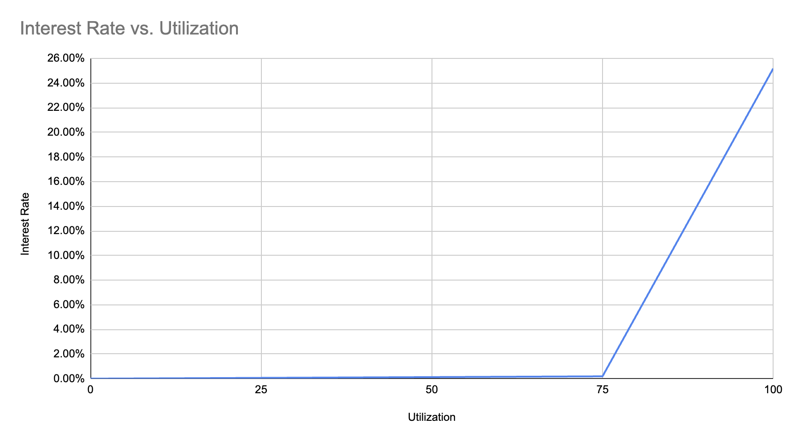

## Simple Summary

<!--"If you can't explain it simply, you don't understand it well enough." Simply describe the outcome the proposed changes intends to achieve. This should be non-technical and accessible to a casual community member.-->

Introduces an interest rate that traders accrue on their open positions.

## Abstract

<!--A short (~200 word) description of the proposed change, the abstract should clearly describe the proposed change. This is what *will* be done if the SIP is implemented, not *why* it should be done or *how* it will be done. If the SIP proposes deploying a new contract, write, "we propose to deploy a new contract that will do x".-->

Based on the configured parameters, an interest rate is accrued by traders impacting their respective PnLs. When trade is closed, the interest accrued is realized by the LPs backing the Perps supermarket.

## Motivation

<!--This is the problem statement. This is the *why* of the SIP. It should clearly explain *why* the current state of the protocol is inadequate.  It is critical that you explain *why* the change is needed, if the SIP proposes changing how something is calculated, you must address *why* the current calculation is inaccurate or wrong. This is not the place to describe how the SIP will address the issue!-->

The introduction of an interest rate could help disincentivize traders from opening both a long and a short, have neutral position, take up space on the OI and lock LPs collateral indefinitely. Based on the utilization rate, the trader will now incur interest which is applied to their PnL. This forces the trader to not grief in this way, risk accruing losses (paid directly to the LPs), or in the worst case get liquidated.

## Specification

<!--The specification should describe the syntax and semantics of any new feature, there are five sections
1. Overview
2. Rationale
3. Technical Specification
4. Test Cases
5. Configurable Values
-->

### Overview

<!--This is a high level overview of *how* the SIP will solve the problem. The overview should clearly describe how the new feature will be implemented.-->

This SIP proposes to upgrades the perps contracts to introduce 3 new interest rate parameters that will enable interest rate accrual on any open positions across any markets within the supermarket.

The parameters:

```
uint256 lowUtilizationInterestRateGradient
uint256 interestRateGradientBreakpoint
uint256 highUtilizationInterestRateGradient
```



The interest accrued is based on which side of the `interestRateGradientBreakpoint` the utilization % is. Below the breakpoint means the interest rate grows at the rate defined by `lowUtilizationInterestRateGradient` and anything above means the interest rate grows at the rate defined by `highUtilizationInterestRateGradient`.

The utilization rate is calculated as follows:

```
lockedOi / marketCreditCapacity
```

Note: `lockedOi` is the entire open interest of all markets in the supermarket multiplied by their respective `lockedOiRatio`.

The interest is accrued by each trader based on their contribution to the locked open interest.

### Technical Specification

<!--The technical specification should outline the public API of the changes proposed. That is, changes to any of the interfaces Synthetix currently exposes or the creations of new ones.-->

Setters/Getters

```
function setInterestRateParameters(
  uint128 lowUtilizationInterestRateGradient,
  uint128 interestRateGradientBreakpoint,
  uint128 highUtilizationInterestRateGradient
) external;

function getInterestRateParameters()
  external
  view
  returns (
    uint128 lowUtilizationInterestRateGradient,
    uint128 interestRateGradientBreakpoint,
    uint128 highUtilizationInterestRateGradient
  );
```

Because utilization rate is dependent on delegated collateral from the LP side, there is no hook that forces the rate on the perps supermarket to be updated when someone (un)delegates. For this reason, a convenience method to manually update the interest rate that could be called the LP app has been added:

```
function updateInterestRate() external;
```

New views have been added to surface the current utliziationRate or the computed interestRate of the supermarket:

```
/**
  * @notice Returns the current market interest rate
  * @return rate
  */
function interestRate() external view returns (uint128 rate);

/**
  * @notice Returns the super market utilization rate
  * @dev The rate is the minimumCredit / delegatedCollateral available.
  * @dev Locked credit is the sum of all markets open interest * configured lockedOiRatio
  * @dev delegatedCollateral is the credit capacity available to the supermarket
  * @return rate
  * @return delegatedCollateral
  * @return lockedCredit credit locked based on OI & lockedOiRatio
  */
function utilizationRate()
    external
    view
    returns (uint256 rate, uint256 delegatedCollateral, uint256 lockedCredit);
```

The integrators can get a trader's owed interest by calling the previously available `getOpenPosition` which now returns that value:

```diff
    function getOpenPosition(
        uint128 accountId,
        uint128 marketId
    )
        external
        view
        returns (
          int256 totalPnl,
          int256 accruedFunding,
          int128 positionSize,
+         uint256 owedInterest
        );
```

New events added:

```
/**
  * @notice Gets emitted when the interest rate is updated.
  */
event InterestRateUpdated(uint128 indexed superMarketId, uint128 interestRate);

/**
  * @notice Emitted when interest rate parameters are set
  */
event InterestRateParametersSet(
    uint256 lowUtilizationInterestRateGradient,
    uint256 interestRateGradientBreakpoint,
    uint256 highUtilizationInterestRateGradient
);

/**
  * @notice Gets emitted after any trade settles and includes interest charged to the trader on previous position
  */
event InterestCharged(uint128 indexed accountId, uint256 interest);
```

### Test Cases

<!--Test cases for an implementation are mandatory for SIPs but can be included with the implementation..-->

New test scenarios have been added to `InterestRate.test.ts`.

- 2 traders, each in different markets.
- 1 trader opens a trade
- the other trader opens and closes trades on a separate market with differing times

Check both trader1 and trader2 have accrued the proper interest based on configured interest rate parameters.

Another test scenario added for when the interest rate parameters are turned off after being turned on: `InterestRate.reset.test.ts`

- Assert functionality that interest stops accruing after interest rate parameters have been disabled but previous interest accrued is preserved.

Added new tests to `GlobalPerpsMarket.test.ts`:

- `setInterestRateParameters`
- `getInterestRateParameters`

### Configurable Values (Via SCCP)

<!--Please list all values configurable via SCCP under this implementation.-->

Please list all values configurable via SCCP under this implementation.

## Copyright

Copyright and related rights waived via [CC0](https://creativecommons.org/publicdomain/zero/1.0/).
