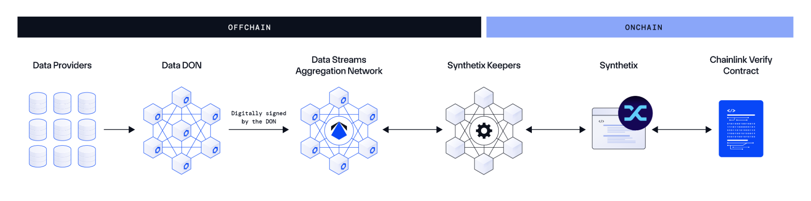
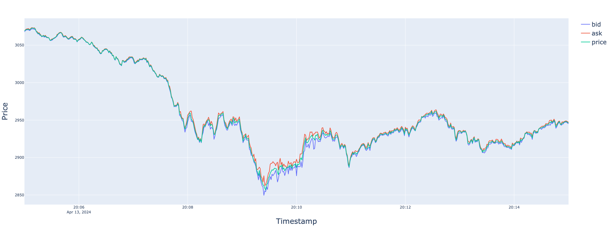
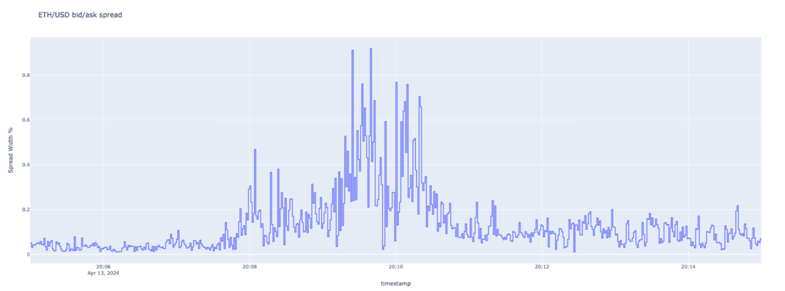
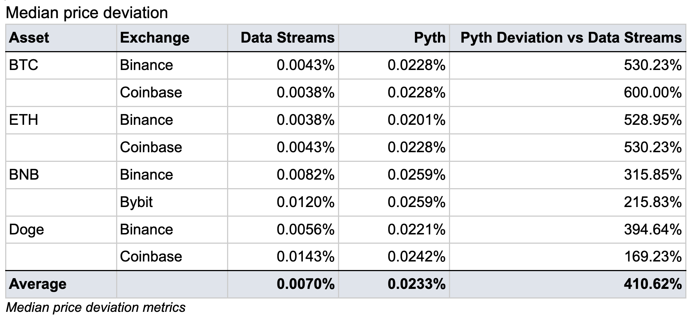
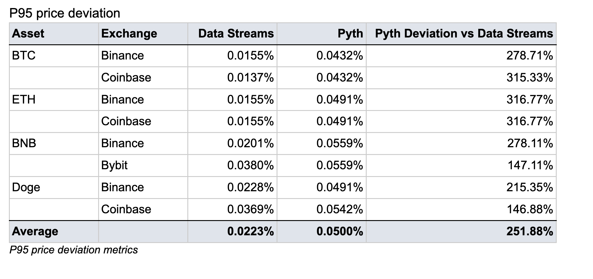
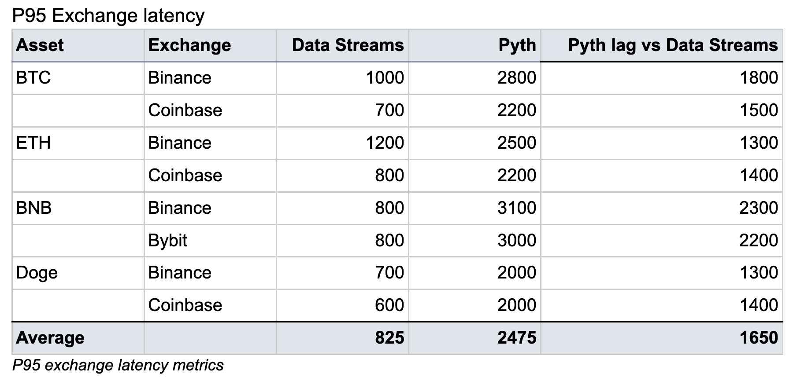
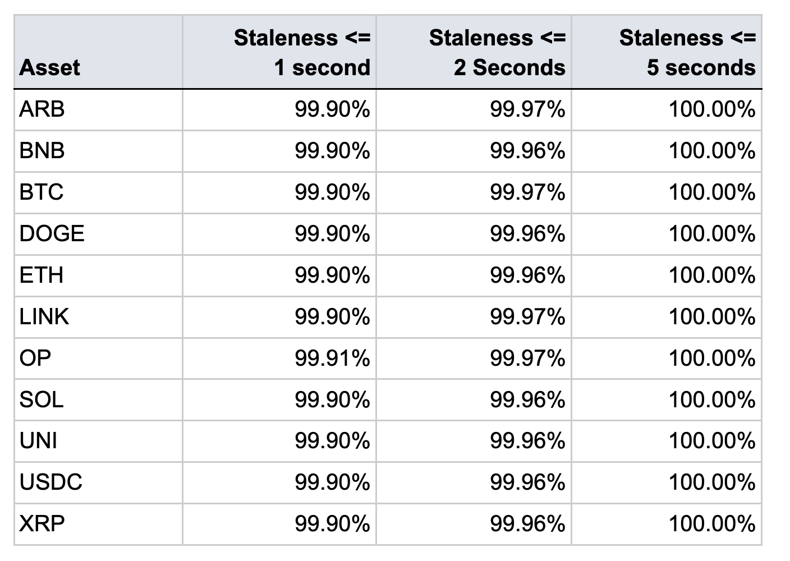
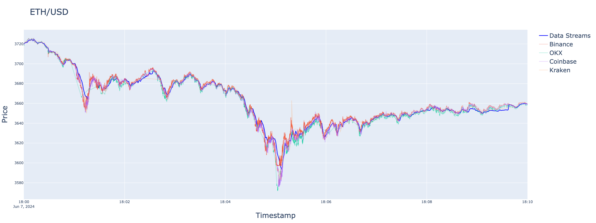
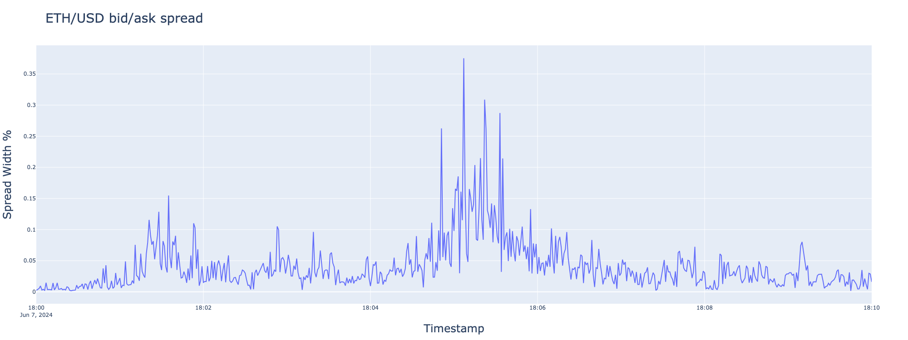
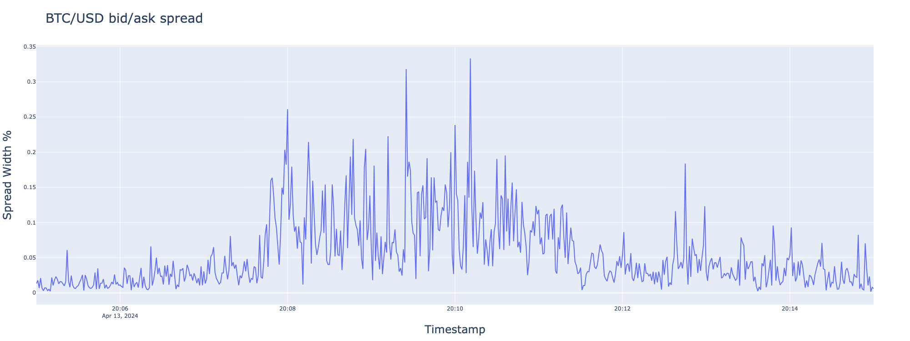

## Simple Summary

This SIP proposes integrating Chainlink Data Streams into the Synthetix V3 deployment on Arbitrum to bolster the protocol’s security and performance.

## Abstract

As outlined in [SIP-367](https://sips.synthetix.io/sips/sip-367/), the Synthetix ecosystem is expanding with a new deployment of Synthetix V3 and Synthetix Perps on Arbitrum Mainnet. This deployment requires a data oracle solution that meets the performance, security, and reliability expectations of Synthetix’ users.

Chainlink [Data Streams](https://chain.link/data-streams)—a low-latency, pull-based data oracle solution—is well-positioned to address each of these requirements and is already compatible with Synthetix V3’s oracle agnostic design, requiring few contract changes. 

Based upon future community feedback and in-production performance metrics from this proposal’s implementation, Synthetix’s usage of Data Streams could be extended to cover additional feeds and markets deployed on alternative networks such as Optimism and Base.

## Motivation

The long-term success of the Synthetix ecosystem is dependent on the protocol’s ability to access high-quality, low-latency, and robust sources of financial market data. As the Synthetix ecosystem continues to expand across the multi-chain ecosystem, the need for an oracle solution that can consistently meet these requirements will grow in importance.

Chainlink Data Streams is well-positioned to support Synthetix’s multi-chain expansion, and has already proven its robustness and reliability in-production by having already secured over $200B in notional trade volume on Arbitrum.

In particular, the launch of Synthetix V3 on Arbitrum as an isolated market presents an opportunity to realize the benefits of Synthetix’s oracle agnostic design. By starting with the use of Data Streams for major crypto pairs on the new Arbitrum market, the Synthetix community can collect data on the performance of Data Streams relative to alternative oracles used for other market deployments. This data can then help inform the future direction of Synthetix’s use of data oracles.  

## Technical Specification

Chainlink Data Streams’ credibly neutral infrastructure is powered by a decentralized oracle network that fetches and aggregates high-quality data, ensuring broad market coverage, ultra-low-latency, high availability, and resistance to manipulation. The proposed implementation includes:
1. **Data Stream nodes:** Sybil-resistant and security-reviewed node operators from Chainlink's extensive network fetch real-time bid, mid, and ask prices from across multiple premium data providers.
2. **Aggregation:** The pricing data oracle reports are aggregated and hosted by the Data Streams - Aggregation Network, helping simplify data access and ease of use for keeper systems.
3. **Synthetix community keepers:** Act as the keeper system, ensuring transactions are processed onchain efficiently and without delays.
4. **Verification:** The onchain Verifier Contract cryptographically verifies node signatures to check data integrity before data is made available for consumption.

_Diagram of Data Streams incorporated into Synthetix_

**Community Participation:** Any community member running a keeper node can apply for Data Streams credentials using a simple form. They will then be provided a set of credentials for access to the Data Streams Aggregation Network. This ensures a wide participation base and decentralization of the trade settlement process.

## Rationale
The Chainlink and Synthetix communities have had a long-standing history in pushing forward DeFi innovation, with Synthetix being the [first user of Chainlink push-based Price Feeds](https://blog.synthetix.io/chainlink-decentralizes-first-wave-of-synthetix-price-feeds/) back in 2019, which later expanded to numerous types of Price Feeds across Ethereum and Optimism. Synthetix now also uses Chainlink Automation and became the [first user of CCIP for cross-chain transfers](https://blog.synthetix.io/synthetix-launches-teleporters-with-chainlinks-ccip/) via the [Synthetix Teleporter](https://liquidity.synthetix.eth.limo/#/teleporter) (cross-chain sUSD). Chainlink Price feeds have secured $56bn of volume on all Synthetix V2 deployments since launch. Given Synthetix’s extensive usage of various Chainlink services for multiple protocol functions, this proposal would add little-to-no additional trust assumptions to the Synthetix protocol.

Chainlink Data Streams offer a number of unique benefits and advantages for the Synthetix ecosystem:
- **Reliability:**  Data Streams is secured by the same decentralized infrastructure and professional node operators that have actively secured tens of billions in DeFi TVL and trillions in total value enabled (TVE) via push-based Price Feeds over the past five-plus years. 
- **Accuracy:**  Node operators aggregate market data from across numerous premium data providers to generate oracle reports with broad market coverage and closely track market benchmarks, even during extreme market volatility. 
- **Security:**  Built-in frontrunning protection can be provided through a “commit-and-reveal” architecture where prices are kept private until transactions are settled.
- **Ultra-low-latency:**  Data Streams provides market-leading latency price updates, reducing the lag from exchange prices to oracle prices and mitigating the risk of front running.
- **Functionality:**  In addition to the mid-price, Data Streams also provides [liquidity-weighted bid/ask quote prices](https://blog.chain.link/liquidity-indicators/) calculated and published at the same time as the benchmark price. This can be used to provide a more realistic trading experience to users, while further protecting the protocol from frontrunning.

Live data from Chainlink Data Streams can be seen on [data.chain.link/streams](data.chain.link/streams), while the documentation can be read at [docs.chain.link/data-streams/architecture](docs.chain.link/data-streams/architecture). 
### Liquidity Weighted Bid and Ask prices
During high volatility, spreads on order books can become very wide. Quoting mid prices during these times exposes protocols and LPs as they are quoting a price that users on spot exchanges cannot realistically receive or hedge. Chainlink Data Streams uniquely offers not just a mid price, but also Liquidity-Weighted Bid and Ask (LWBA) prices. These three prices collectively offer a pricing spread that provides protocols with information about the activity in the market derived from the current state of the order books.

Protocols like Synthetix can use the bid and ask to provide a superior trading experience and reflect the liquidity in the market during periods of volatility. The chart below shows how the LWBA widens during periods of high volatility and then returns to a tight spread afterward.

_Data Streams LWBA spread on ETH/USD during April the 13th 2024_

### Data Streams Performance

Data Streams more than satisfies the performance requirements of Synthetix, as shown in a set of analyses conducted by the Chainlink Labs team and third party analysis on latency and exchange deviation performed by Chaos Labs using their oracle comparison dashboard. Below are summaries of these statistical analyses with the most salient performance benchmarks impacting Synthetix’s choice of oracle provider. 
### Benchmark Deviation 
The exchange deviation is a critical measure of price accuracy. This measures how far away from the benchmark exchanges the oracle prices are, which impacts the accuracy of the markets. This data was taken directly from the Chaos Labs oracle dashboard on June 23, 2024 at 20:00 CET on the 7D setting. 

- This analysis measures absolute price deviation of Chainlink Data Streams and Pyth vs. two major centralized exchanges.
- A median value of 0.01% means the Data Streams or Pyth price was within 1 basis point (bps) of the benchmark on 50% of observations.

**Conclusion**: The data shows Chainlink Data Streams was within 1.5 bps of the benchmark 50% of time and within 4 bps of benchmarks 95% of the time. Pyth was on average 410% and 251% further away from the benchmark, highlighting Data Streams’ superior accuracy compared against the benchmark exchanges. 

### Centralized Exchange to Price Latency
The latency embedded in oracle reports is critical for assessing the frontrunning threat. Data Streams offers industry-leading latency, and has been validated by third-party assessments.  This data was taken directly from the Chaos Labs oracle dashboard on June 23, 2024 at 20:00 CET on the 7D setting. Chainlink Labs’ internal data shows a similar gap between Pyth and Chainlink Data Streams but with higher absolute numbers on both oracles. This is likely because these numbers are sensitive to the methodology used such as bin sizing and data processing methods.

This analysis measures the correlation of oracle returns vs. benchmark CEXs at various lags. The oracle lag with the highest correlation is deemed to be the latency.

- The results below are stated in terms of milliseconds (700 means 700 milliseconds).
- A value of 700 implies that the oracle lagged the Exchange by 700 milliseconds

**Conclusion:** The data shows Chainlink Data Streams had a price latency of no more than 1200 milliseconds 95% of the time. Chainlink Data Streams also exhibited significantly lower latency compared to centralized Exchanges than Pyth who was on average 1650 milliseconds slower.

### Price Report Production
For any trading protocol it is important that prices are not just accurate and low latency, but are also available to fetch whenever needed. Because Synthetix allows trades continuously on a 24/7 basis, high uptime for data availability is critical. 

This analysis measures the length of gaps in report production. A value of 99.99% at 5 seconds would indicate that 99.99% of the time, report age/staleness was no more than 5 seconds. This analysis was performed from May 24th to June 22nd. 

**Conclusion:** 99.90% of the time report staleness was at 1 second or below, 99.97% at 2 seconds or below and 100% of times Data Streams produced a new price report within 5 seconds of the last.

### High Volatility Periods
Measuring the performance of oracles during past periods of high volatility is an essential indicator that the Synthetix community should consider when assessing an oracle’s ability to perform reliably during future periods of high volatility.

Looking at the performance of Data Streams in high volatility periods, Data Streams maintained tight correlations with major CEX benchmarks. We will examine two periods in detail, showing the deviation of the mid price to the benchmarks as well as how the LWBA behaved to widen in response to market uncertainty.

Unlike alternatives that provide only a mid price, Data Streams also delivers a bid and ask data point, allowing end users' pricing to better reflect current market liquidity. This approach offers Synthetix an effective method for managing risk, especially during periods of high volatility. Without the availability of bid and ask data points, Synthetix LPs could be quoting a mid price that is unrealistic because it reflects a mid price that is very far away from what any trader on the spot market would experience. This advantage is evident as Data Streams' spread widens during volatile periods and normalizes afterward.

**Period 1 - June 7th 2024, 18:00-18:10**

**Period 2 - April 13th 2024, 20:05-20:15**

### Analyses Summary

In summary, these analyses show that Chainlink Data Streams empirically presents a highly secure, reliable, and performant solution for Synthetix across the following key performance indicators:
- **Benchmark Deviation:** Chainlink Data Streams is within 1.5 bps of the benchmark 50% of time and 4 bps of benchmarks 95% of the time. Pyth was on average 410% and 251% further away from the benchmark
- **Price Report to Exchange Latency:** Chainlink Data Streams lagged exchanges no more than 200 milliseconds 50% of the time, and within 850 milliseconds 95% of the time. Pyth was on average 1650 milliseconds slower.
- **Price Report Production Uptime:** Data Streams achieved 100% uptime of report production within 5 seconds over the past 30 days.
- **Performance During Periods of High Volatility:** Because Data Streams deliver mid, bid, and ask data points, it provides an effective means for risk management during periods of high volatility with widening and then tightening spreads corresponding to real levels of liquidity across exchanges.

### Economics

To ensure Chainlink Data Streams can sustainably provide Synthetix with an independent, verifiable, and low-latency source of financial market data, this proposal establishes an economic framework involving a revenue-sharing fee structure. Specifically, 1.5% of the total trading fees and liquidation fees generated on markets where Chainlink Data Streams are used would be paid in exchange for the oracle service. The proposed split of fees is as follows: For every $100 of trading fees generated, 1.5% would go to the oracle services. The remaining amount would then be divided among the protocol, LPs (Liquidity Providers), integrators, and the keeper incentive as seen fit by Synthetix. This arrangement provides Synthetix access to Data Streams, including all generally available feeds, along with unlimited onchain verifications at no added premium. 

### Deployment Plan

With this proposal, the rollout will commence on the Arbitrum network, focusing initially on major cryptocurrency pairs for BTC, ETH, ARB, LINK, XRP, BNB, DOGE, SOL, UNI, and OP. Depending on community feedback and performance metrics, the integration can extend to additional feeds and to other networks like Optimism and Base.

Keeper runners can request API credentials in an anonymous form that will be shared with the community. Chainlink Labs will collaborate with the keeper community to update the Synthetix SDK and ensure that the markets will be fully supported.

The timeline for integration is expected to be 8-12 weeks dependent on the technical development work. We welcome community involvement and feedback on the implementation and hope it will further the ties between the Synthetix and Chainlink communities.

### Test Cases

<!--Test cases for an implementation are mandatory for SIPs but can be included with the implementation..-->

N/A

### Configurable Values (Via SCCP)

<!--Please list all values configurable via SCCP under this implementation.-->

N/A

## Disclaimer
Chainlink Labs’ work is offered “as is” without representations, guarantees, or warranties of any kind, on a commercially feasible basis and subject to Synthetix DAO’s acceptance of the Chainlink Labs terms of service (available at Terms of Service – Chainlink Labs). The benefits are solely being made available to the Synthetix platform and not to any other party, including Synthetix DAO.

## Copyright

Copyright and related rights waived via [CC0](https://creativecommons.org/publicdomain/zero/1.0/).
