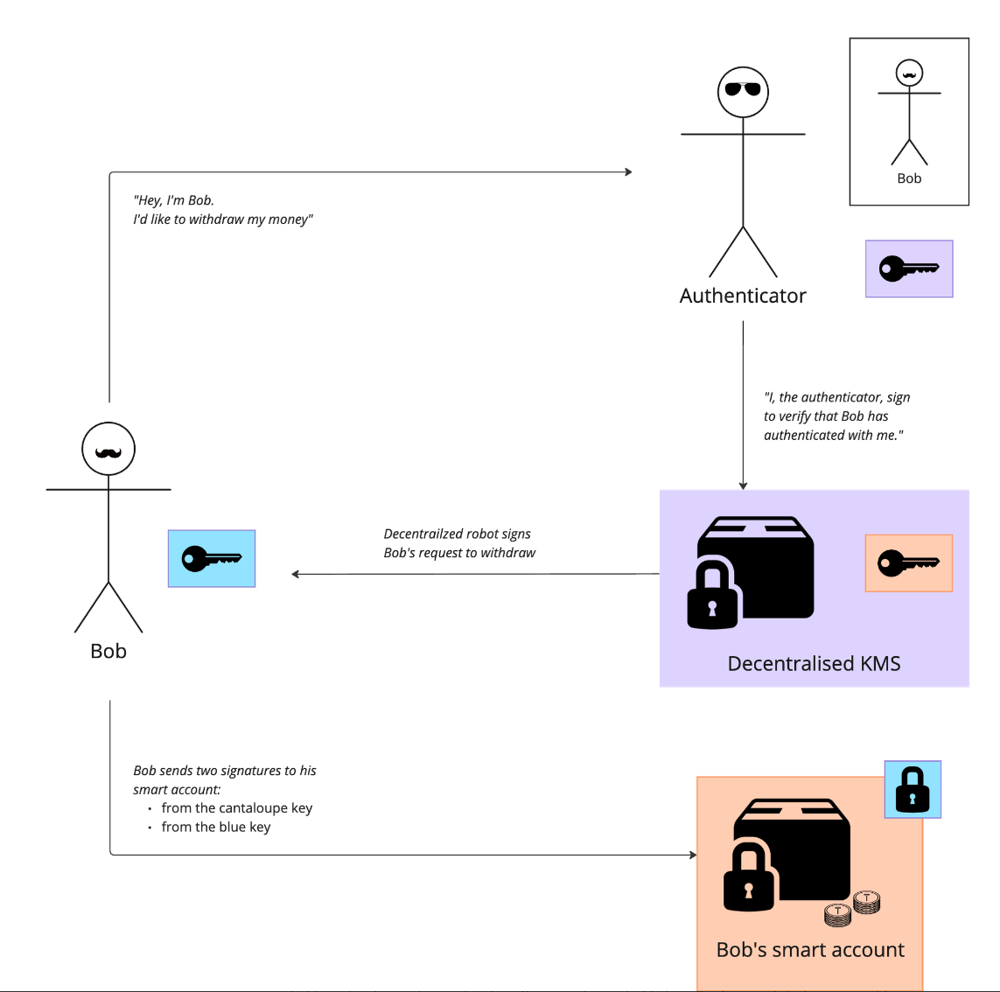
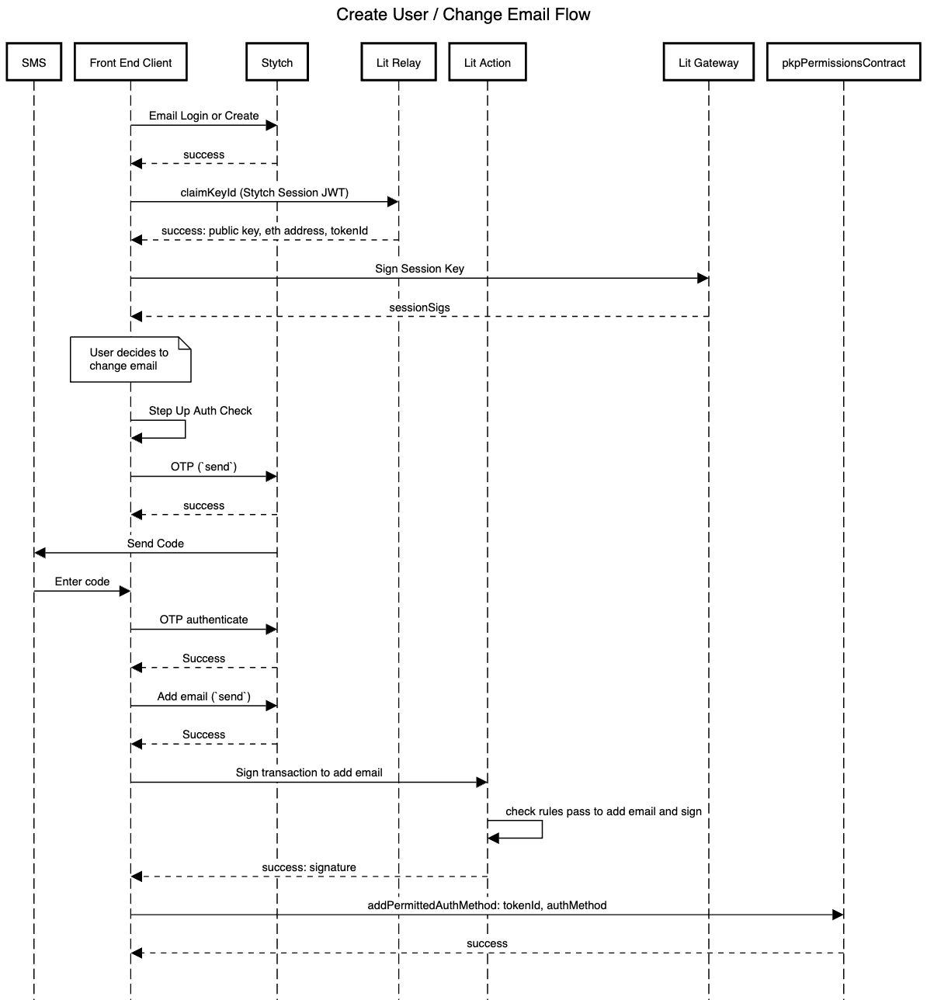

# Simple Summary

This XIP proposes the framework for the security module that will secure user funds on Infinex.

# Abstract

To reach mainstream users, Infinex needs a security system that allows users to secure their accounts using their preferred online identity and multi-factor authentication configuration. This system must be robust against breaches or loss of the users constituent security artefacts.

Centralized exchanges all employ a tried and tested security model that achieves these goals by allowing the user to configure their security preferences with off-chain authentication, and a security model that minimises the risk of account loss and unauthorised draining of funds. The challenge of the Infinex security core is to emulate this user experience while preserving self-custody. To achieve this, this XIP proposes Infinex generates a smart contract for each user that is controlled by a key stored in the users browser (browser key), recoverable by a second key that is trustlessly gated by offchain multi-factor authentication (MFA), while ensuring the controller of the second key doesn't have custody over the users smart account.

# Motivation

In order to outline the problems that this proposal aims to solve with the Infinex security core architecture, we will explore stylized examples with a user, Bob, who is new to the space.

Bob is trying to decide whether he should sign up to trade on a centralized exchange, or onboard himself into DeFi.

### The DeFi solution

To onboard into DeFi, Bob can create a wallet on Ethereum, and transfer his funds into it.

Bob learns that this solution has some interesting advantages:

- **Bob controls his funds**: the only actor who can touch the funds in Bob’s wallet is Bob, or someone else that Bob explicitly approves. This is because Bob is the sole bearer of the key to his wallet.
- **Bob can interact with all of Ethereum**: the composability of DeFi means that Bob’s money is programmable, and can be plugged into any decentralized application that has ever been built on the network, or will be built in the future.

Bob soon becomes cognisant of the inherent constraints of this approach. Should Bob misplace his key, he is in severe trouble. Given committing the seed phrase to paper is advocated as the optimal method to eschew online repositories and associated cybersecurity risks, Bob finds this measure daunting and excessively onerous. As such, he continues to explore.

### The CeFi solution

Bob proceeds to create an account with a centralized exchange (CEX). He selects a platform, submits requisite personal information, deposits funds, and then initiates trading activities. Subsequent to the preliminary registration process, Bob’s responsibilities are substantially reduced – the exchange assumes the duty of verifying his identity, safeguarding his capital, matching his trades, and upgrading his security.

Imagine a figurative security guard sitting inside a CEX, called the Authenticator. This entity possesses a digital representation of Bob, informed by the information he provided upon creating an account (imagine a picture of Bob on the authenticator’s office wall). Upon Bob’s request to access his account, he must convince the Authenticator that he is indeed the same Bob. This is achieved by providing his username and password, or via some social-sign. See below for a visual representation:

However, if Bob seeks to do something more sensitive, such as change his password due to forgetfulness, the Authenticator has the descretion to reconfirm his identity. This may involve requesting one or multiple one-time paswords from Bob, depending his specified security prefernces.

In the event that Bob changes his identification details, such as his phone number, he is again only required to demonstrate to the Authenticator that he still Bob, granting him access to his money as normal. This procedure is efficacious on the grounds that, at a fundamental level, Bob remains unchanged and he can likely prove it through available digital verification means.

Should a hacker attempt to impersonate Bob, the CEX should catch onto this. The Authenticator has a refined security handbook that minimizes the risk of an attacker imitating Bob and stealing his funds (account hack state), while simultaneously minimizing the chance that Bob be unable to verify his own identity and loss access to his money (account loss state).

This is a really robust and scalable solution because Bob has been given the absolute **minimal marginal responsibility** over his account. Bob doesn’t have to carry anything around that he doesn’t already carry around – his emails are accessible from his computer, his passwords are kept in his password manager, and his phone is in his pocket. The CeFi solution has a security model that is also already integrated into the world that Bob lives in. This is a UX that can scale.

The disadvantages of this approach are obvious: Bob’s savings are held by an opaque, scantily-regulated offshore entity, that also holds full control over authentication. Additionally, his money is also no longer programmable – it’s confined within the walls of the exchange and limited to the products that the exchange builds.

### The challenge, therefore

The Infinex security module will emulate the structural interface of the CeFi solution in a trustless and decentralized fashion. This can be achieved by deconstruction of the constitutent actors and functions in CeFi security architecture. For the Infinex security module to be deemed successful, Bob would maintain sole ownership over his funds while maintainng the composability with the rest of Ethereum.

Here’s what this ideal system would look like:

From top-left to right:

1. The authenticator does nothing but authenticate Bob and sign attestations that he has authenticated via any specified combination of factors.
2. A decentralized key management system (KMS) holds Bob’s key, and can only release a signature if Bob’s security settings allows it (stored in IPFS and run on encrypted machines).
3. Bob holds a key on his device.
4. Bob’s onchain smart account requires signatures from both the blue key and the cantaloupe key for sensitive transactions.

A simple withdrawal flow would therefore work like this:

An important piece of this map is in decoupling the authenticator from the key management system (KMS), while preventing the KMS operators from accessing Bob’s key (unless they are Bob). This sounds like magic, but has become possible in recent months with the Lit protocol's use of AMD SEV-SNP compute to build the first known trustless, generalised KMS.

The aspect of **marginal responsibility** beyond Bob’s off-chain authentication is the blue key that he holds on his device. To avoid making this a single point of failure, this key needs to be recoverable, and thus the scope of it’s authorization on Bob’s account must be limited. It should be easily duplicatable, so that Bob can switch devices. It also has to be resistant to cross-site scripting attacks. The UX of using this key should be seemless, such that Bob doesn’t need to know there is a key on his device.

# Specification

## Auxiliary files

- [Stytch and lit](assets/Stytch_and_Lit_Auxiliary_file.pdf)
- [Offchain security model](assets/Offchain_Security_Model_Auxiliary.pdf)
- [Browser key storage](assets/Browser_Key_Storage_Auxiliary_File.pdf)

## **Overview**

The proposed Infinex security module uses three key architectural features:

Firstly, it designates each user account as a smart contract, which we will title the ‘smart account’, responsible for holding their assets. Secondly, each onchain actions can be gated by a signature (or signatures) from multiple of keys at the smart contract level. Finally, the keys that control the account are distributed between the users device, and a decentralized key management system, which is gated by trustless offchain authentication such that no third party can control the users funds.

## Each user owns an onchain smart account

This smart contract will hold the users funds, and will be controlled cryptographically by the user. From this smart contract, the user can interact with the rest of DeFi (i.e. trade perpetual futures via Synthetix). The users smart account will be located on the same chain as the first integration for Infinex. If this is Synthetix PerpsV3, the smart account will be located on Base or Optimism.

## Each smart account is controlled by three keys

1. Browser key – held on the users device
2. Multi-factor authentication (MFA) key – held in a decentralised KMS
3. Recovery key – held in a decentralised KMS

To execute low sensitivity actions, such as opening a trade position, users would only require a single signature from the browser key.

To execute high sensitivity actions, such as withdrawing funds or adding a whitelisted withdrawal address, users would require two signatures – one from a browser key and one from an MFA key. This protects the users account if someone were able to get access to their device.

A third key, the recovery key, is used to add a new browser key to the users smart account. This is a crucial component for robustness of the system: avoiding catastrophe when a user loses their device, and enabling the user to control their smart account from multiple devices.

A new browser key can be added via:

1. A signature from the recovery key, and the passing of a `recoveryDelay` delay period
2. A signature from the recovery key and a signature from another active browser key

During the `recoveryDelay` delay period, an active browser key can reject any account recovery task, effectively protecting the user if their recovery key were to be compromised.

## Emergency withdrawal addresses

Emergency withdrawal addresses are an optional fourth key that has control over an account. These act as an escape hatch for advanced users who want a way to withdraw funds from their account directly onchain, without needing to go through the decentralised KMS or their trading device. Adding an emergency withdrawal address would require signatures from a browser key and an MFA key.

## Key settings are configurable

The keys that control a users smart account will be able to be changed through adjusting the settings in the smart account. This means a user can add multiple devices, or a new browser key pair to use as a scope-limited API key that can’t withdraw from their account. If they wanted a withdrawal key, they could add an emergency withdrawal address, offering an experience akin to a centralized exchange. Additionally, if the user would prefer to hold their own MFA key or recovery key, they can simply update their smart account key configuration to accept signatures from their own hardware wallet instead of the preconfigured MFA key. 

This customizability offers a gradient of control for advanced users who want more or less responsibility of managing their own keys. It also allows for social recovery (Alice’s hardware wallet could be added as a recovery signer for Bob’s account)

### Key configuration
|Name|Requires|Notes|
|:----|:----|:----|
|Add browser key|Recovery key signature| |
|Remove browser key|Active browser key signature| |
|Activate browser key|`recoveryDelay` period, or active browser key signature|While any browser key can be used to trade, only an active browser key can be used as a second factor for sensitive actions (like withdrawing)|
|Add, remove, or change recovery key|Active browser key signature and (MFA key or recover key) signature| |
|Add, remove, or change MFA key|Active browser key signature and (MFA key or recover key) signature| |
|Add emergency withdrawal address|Active browser key signature and MFA key signature| |

## Each key is gated by trustless off-chain security

### Browser key storage

The browser key will be accessible from the frontend via a cross-domain iframe architecture. This forms a “service within a service” separation, preventing frontend code from accessing the keys directly, while still allowing it to request signatures from the service. Furthermore, browser keys are encrypted with the user’s smart account contract address, so that a scanner looking for private keys on a compromised hard drive would be unable to find them. Keys persist unless the user clears their browser application storage for the key storage domain.

For more information on browser key storage, see the [auxiliary file](assets/Browser_Key_Storage_Auxiliary_File.pdf).

### Off-chain authentication

To reduce the magnitude of a compromised browser key, the MFA key and recovery key will not be held by the user in the default case – instead, they will be stored as sharded **programmable key pairs** (PKP) on a decentralized key management service operated by the [Lit protocol](https://developer.litprotocol.com/v2/resources/glossary/). Access to the keys is gated by JavaScript code called a ********************Lit action********************, stored on IPFS and executed by Lit node operators.

The Lit action contains logic for releasing signatures to user authenticated by an offchain authentication provider, ************Stytch************. Their offchain authentication configuration is stored in the users **permissions contract** on the Lit network, which can only be modified with a signature from the PKP.

The diagram below demonstrates how these pieces would fit together for Bob, who would like to withdraw money from his onchain smart account:

The flow is easiest to comprehend when considering Bob’s end goal – to withdraw funds.

- To withdraw onchain funds, Bob’s smart account contract requires two signatures – one from his browser key and one from his MFA key
- To get a signature from his MFA key, Bob needs to pass the logic in the Lit action
- To pass the logic in the Lit action, Bob needs an authenticated JWT from Stytch that matches the configuration in his permissions contract
    - In order to update the configuration in his permissions contract, he would also need an MFA signature, requiring Bob to go through a similar flow
    - For a further breakdown of the authentication logic for different actions, see *Off-chain security model* below.

When Bob requests a signature from his MFA key or their recovery key, or to change their security settings, they will firstly have to authenticate themselves to Stytch via the Infinex UI, and then present their Stytch signed JWT to the Lit action, which will check it against their **permissions contract**, before constructing their key and releasing a signature. 

A more detailed specification for how a user would create a new account and then change his email address is outlined in the following sequence diagram:

More sequence diagrams can be found in the [auxiliary file](assets/Stytch_and_Lit_Auxiliary_file.pdf).

### Upgrading a Lit action

The Lit node operators run encrypted virtual machines ([AMD SEV-SNP](https://www.amd.com/content/dam/amd/en/documents/epyc-business-docs/white-papers/SEV-SNP-strengthening-vm-isolation-with-integrity-protection-and-more.pdf)) to house **programmable key pairs** (PKPs) and execute Lit action code, meaning the node operators cannot modify the logic of the Lit action without acquiring a signature via the Lit action itself.

Infinex governance can upgrade Lit actions by deploying new code to IPFS, and having the user request that the Lit action points to the new IPFS ID (the `litActionIPFSID`). This means that Infinex Governance can’t upgrade the Lit action logic without the users consent.

The previous `litActionIPFSID` will be saved in an Infinex protocol-level settings contract so that Infinex Governance can easily roll back to a ‘safe’ deployment of the Lit action, particularly if a new deployment introduces unrealized critical errors. 

### Off-chain security model

A user can secure their Infinex account with any combination of the following off-chain MFA methods:

- Mobile SMS OTP
- TOTP Authenticator
- Passkey
- Ethereum Signer
- Email OTP (enabled by default)
- Social sign-in/login credentials (enabled by default)

Note that an Ethereum signer can be used as an **off-chain** **MFA** method, in addition to an on-chain signer in the users smart account. This means an advanced user who still wishes to use the decentralized KMS to house their MFA key or recovery key can use their wallet as a second layer of cryptographic security.

Any signature from a key kept on the Lit network (a users’ MFA signer or recovery signer) is only accessible via the Lit action logic. It is therefore the responsibility of the Lit action to minimize two risks for the user:

1. **Loss state**: the user no longer being able to access an MFA or recovery signature, and therefore losing access to the funds held in their smart account
2. **Hack state**: an unauthorised person accessing the users MFA and recovery signature, enabling them to withdraw the users funds

Additional goals for the security model are

1. **Positive marginal security**: if a user has configured more authentication methods, either the risk of loss state and hack state should be reduced
2. **Users suffering hack or loss state should be unreasonably unlucky**: achieving loss state should require losing access to uncorrelated security artifacts (for example, losing access to your laptop, password, and email all at once). A measure of what is ‘reasonable’ will of course be influenced by how well-secured their account is.
3. **Minimal UX burden**: Two solutions with the same ramifications on loss and hack state exist, the one with less user action required is preferred.
4. **Resistant to cascading attacks**: Let’s say you’re trying to secure a castle with a door that can be unlocked by a key, and next door to the castle there’s a golden key factory. Breaking into the key factory should be more complicated for an intruder than entering the castle with a key in hand. In practical terms, resetting Bob’s TOTP should be harder for an intruder than using his TOTP to get an MFA signature.

To achieve these goals, we firstly apply a general ruleset for off-chain security actions:

### General Ruleset
|Security Action|Requirement/Rule|
|:----|:----|
|Reset Password|All Enabled Security Methods ex. 1 **and** Email OTP|
|Add MFA Method (Authenticator, Mobile SMS, Passkey)|All Enabled MFA Methods and Email OTP **or** Ethereum Signer|
|Get MFA Signature (Strict)|All Enabled MFA Methods and Email OTP **or** Ethereum Signer|
|Get MFA Signature (Relaxed I)|All Enabled Security Methods ex. 1 **and** Email OTP **or** Ethereum Signer|
|Get MFA Signature (Relaxed II)|All Enabled MFA Methods ex. 1 **and** Email OTP|
|or Ethereum SignerActivate Active Browser Key (ABK)|MFA Signature **and** 7 Day Delay   **or** MFA Signature **and** ABK Signature|

Here, ***All Enabled Security Methods ex. 1***, refers to the user condition in which they possess all but one of the security methods enabled on their account. 

******************Example: User A has enabled Authenticator, Mobile SMS and Ethereum Signer******************

User A can reset their password, given they have their email, authenticator and mobile SMS.

******************Example: User B has enabled Authenticator, Mobile SMS and Passkey******************

User B can reset their password, given they have their email, as well as any combination of two enabled security methods

********NB:******** Behavior for users with 2x MFA methods and Ethereum Signer is **equivalent** to ***All Enabled MFA Methods*** — requiring 2x MFA or Ethereum Signer but strictly weaker for users with 3x MFA methods — requiring 2x MFA methods rather than 3x MFA methods.

Similarly, ***All Enabled MFA Methods ex. 1***, refers to the user condition in which they possess all but one of the MFA methods enabled on their account.

******************Example: User A has enabled Authenticator, Mobile SMS, Passkey and Ethereum Signer******************

User A can retrieve their MFA signature, given they have their email and any combination of two enabled MFA methods (Authenticator, Mobile SMS,Passkey)

********NB:******** Since enabled MFA methods ARE enabled security methods, this relaxation is weaker than the previous relaxation.

Moreover, we have also detailed two “relaxations” for users to retrieve their MFA signature. Users with at higher security enabled retrieve their MFA signature in a “relaxed” manner to ensure UX is not compromised and consistent with the rest of the platform. The relaxation allocation is given in further sections with respect to security levels/user buckets.

We bucket users by their security configurations, from least secure to most secure:

### Security Buckets
|Level|Descriptor|Methods Enabled|
|:----|:----|:----|
|Level 0|No Security Methods Enabled| |
|Level 1|1x Security Methods Enabled|[Mobile SMS], [Authenticator], [Passkey], [Ethereum Signer]|
|Level 2|2x Security Methods Enabled|[Passkey, Ethereum Signer], [Mobile SMS, Ethereum Signer],   [Mobile SMS, Passkey], [Authenticator, Ethereum Signer]   [Authenticator, Passkey], [Mobile SMS, Authenticator]|
|Level 3|3x Security Methods Enabled|[Mobile SMS, Passkey, Ethereum Signer],   [Mobile, Passkey, Authenticator],   [Passkey, Authenticator, Ethereum Signer],   [Mobile SMS, Authenticator, Ethereum Signer]|
|Level 4|4x Security Methods Enabled|[Mobile SMS, Authenticator, Passkey, Ethereum Signer]|

Below is the relaxation allocation, with respect to the security buckets,

### Relaxation Allocation
|Relaxation Level|Security Levels|
|:----|:----|
|Strict|Level 0, Level 1, Level 2|
|Relaxed I| Level 3|
|Relaxed II| Level 4|

To each bucket we then apply a points-threshold security system. For each security bucket, a **points map** and a **requirements map** are defined, and configured to achieve the goals outlined above. To achieve a security action defined below, the user needs to satisfy the points requirement **and** the requirements outlined in the general ruleset.

**Example Security Methods Points Map: Bucket Level 1** 

### Security Method Points Map
| Name      | Points |
| ----------- | ----------- |
|Active Browser Key (ABK)|20.0|
|Email OTP |5.0|
|Authenticated Credentials|1.0|
|Authenticator MFA|10.0|
|Mobile SMS MFA|10.0|
|Passkey MFA|10.0|
|Ethereum Signer|10.0|

**Example Points Map: Bucket Level 0**

### Points Ruleset Map
| Security Action      | (Points) Requirement |
| ----------- | ----------- |
|Login|5.0|
|Reset Password|5.0|
|Add Authenticator|26.0|
|Add Mobile SMS|26.0|
|Add Passkey|26.0|
|Change Email |26.0|
|Get MFA Signature|6.0|

The full table pairs for all security levels can be found in the [auxiliary file](assets/Offchain_Security_Model_Auxiliary.pdf)

To minimise the protocols net loss and hack states, the Infinex UI will usher users into security buckets based on the value of their deposits:

### Security Bucket Enforcement
|Name|Account Value|Tags| 
|:----|:----|:----|
|Low Risk|> $0|Level 1 Encouraged|
|Medium Risk (I)|≥ $10k|Level 1 Enforced|
|Medium Risk (II)|≥ $25k|Level 2 Encouraged|
|High Risk|≥ $50k|Level 2 Enforced|

# Rationale

The specification proposed above can be evaluated on the goals outlined in the motivation section.

### Custody

No one can access the funds in a smart account except for the user who controls that smart account. There is no way for the Lit node operators, the Infinex DAO or core contributors to gain access to their funds, as they don’t know the users authentication credentials and/or have access to their MFA devices.

### Recoverability

We have developed an exhaustive list of account loss states for users of all buckets and MFA configurations. 

************************************************************Loss State Table Example: Security Bucket Level 0************************************************************

### Loss States
|Loss State|Notes| 
|:----|:----|
|Lose Email|Recoverable by Email Providers, e.g. Google, Microsoft, etc.|

************************************************************Loss State Table Example: Security Bucket Level 4************************************************************

### Loss States
|Loss State|
|:----|
|Lose [3x MFA Methods]|
|Lose [2x MFA Methods] + Lose [Credentials or Ethereum Signer] Lose Credentials + Lose [1x MFA Methods] + Lose [Email or Ethereum Signer]|
|Lose Email + Lose Ethereum Signer + Lose [Credentials or Device]|

The full tables of loss states in the [auxiliary file](assets/Offchain_Security_Model_Auxiliary.pdf).

### Security

Accepting that the most crucial point of security is the off-chain MFA configuration, we can assess the security of a users account by observing prerequisites of the hack states for various users.

************************************************************Hack State Table Example: Security Bucket Level 0************************************************************

### Hack States
| Hacker Initial States | Action Path|
| ----------- | ----------- |
| Hacker Steals Email | -> Reset Password   -> Login   -> Get MFA Signature   -> Add New Browser Key **(Inactive)**   -> Wait 7 Days **(Activate Browser Key)**   -> **DRAIN** |

************************************************************Hack State Table Example: Security Bucket Level 4************************************************************

### Hack States
| Hacker Initial States | Action Path|
| ----------- | ----------- |
| Hacker Steals Credentials + Ethereum Signer + [1x MFA Methods] | -> Login   -> Get Ethsig   -> Add New Browser Key **(Inactive)**   -> Wait 7 Days **(Activate Browser Key)**   -> **DRAIN** |
| Hacker Steals Active Device + Credentials + [2x MFA Methods] | -> Login   -> Change Email   -> Get MFA Signature   -> **DRAIN** |
| Hacker Steals Credentials + Email + [2x MFA Methods] | Login   -> Get MFA Signature   -> Add New Browser Key **(Inactive)**   -> Wait 7 Days **(Activate Browser Key)**   -> **DRAIN** |
| Hacker Steals Email + Ethereum Signer + [2x MFA Methods] | -> Reset Password   -> Login   -> Get Ethsig   -> Add New Browser Key **(Inactive)**   -> Wait 7 Days **(Activate Browser Key)**   -> **DRAIN** |
| Hacker Steals Email + [3x MFA Methods] | -> Reset Password   -> Login   -> Get MFA Signature   -> Add New Browser Key **(Inactive)**   -> Wait 7 Days **(Activate Browser Key)**   -> **DRAIN** |
| Hacker Steals Ethereum Signer + [3x MFA Methods] #1 | -> Get Ethsig   -> Change Email   -> Reset Password   -> Login   -> Add New Browser Key **(Inactive)**   -> Wait 7 Days **(Activate Browser Key)**   -> **DRAIN** |
| Hacker Steals Ethereum Signer + [3x MFA Methods] #2 | -> Change Email   -> Get MFA Signature   -> Reset Password   -> Login   -> Add New Browser Key **(Inactive)**   -> Wait 7 Days **(Activate Browser Key)**   -> **DRAIN** |

The full tables of hack states can be found in the [auxillary file](assets/Offchain_Security_Model_Auxiliary.pdf).

# Parameters

Here we define governance controlled parameters that can be amended in future proposals:

- `recoveryDelay` is proposed to be initialised to seven days.
- `litActionIPFSID` will be initialised the first Lit action is deployed to IPFS.

# Test cases

## **Account Recovery**

*Lost browser key*

Should a user lose their browser key, they can initiate a recovery procedure using their designated recovery key. Upon initiation, a seven-day `recoveryDelay` period is triggered, adhering to the principles of [time delayed social recovery](https://vitalik.ca/general/2021/01/11/recovery.html).

During this waiting period, the original browser key is in an 'inactive' status. While in this state, it retains certain capabilities such as trading, but is barred from executing high sensitivity actions like withdrawals, ensuring security during the recovery phase. Bypassing the waiting period will be possible by utilizing both the recovery key and an active browser key. 

*Lost MFA method*

If a user loses an MFA method, they will be able to replace it using the logic defined in the off-chain security model. Although there are some cases where the user loses access their account, these are reasonably obscure, and become less likely the higher the security configuration. For example, a user with level four security (four MFA methods enabled) would need to lose three MFA methods in order to completely lose access to their account.

*Lost log-in credentials*

If user credentials are lost, users will have the ability to reset their credentials by the logic defined in the off-chain security model.

## Account Security

*Compromised hard drive*

Since all browser keys are encrypted via the users smart account contract address, decryption of the key will require knowledge of the users trading account. This provides an extra layer of difficulty for an attacker over storing the keys in plain text.

*Cross-site scripting (XSS)*

XSS is another risk associated with the browser key. To mitigate this threat, a cross-domain iframe architecture to create a “service within a service” separation would be adopted. This will prevent frontend code of the site that is affected from directly accessing private keys, thereby mitigating XSS risks. Furthermore, private keys will be encrypted using the user's smart account contract address, meaning an attacker would also have to know the users onchain behaviour to do anything with the key.

*Hacked recovery key*

If an attacker were to obtain the MFA key and subsequently access the user's device, they would gain the ability to perform high sensitivity operations. 

If an attacker were to obtain the recovery key, this would allow them to register a new browser key after a seven-day delay period. If the seven days has passed, the hacker would now possess the original MFA and a new browser key, which would allow them to generate the necessary signatures to execute sensitive transactions without the original device (i.e. withdraw their funds). The time delay seeks to provide as much opportunity for legitimate users to detect this threat.

*Compromised user credentials*

If a user’s credentials are compromised, the account MFA would provide necessary protection. A successful breach, however, would require the hacker to compromise fairly uncorrelated barriers such as the authenticator and the password, or even more difficult barriers such as the user’s device.

*Compromised off-chain MFA method*

If a user’s off-chain MFA method is compromised (such as their their YubiKey or TOTP), the account should still be robust against having its funds drained. A successful breach, however, would require the hacker to compromise fairly uncorrelated barriers such as the authenticator and the password, or even more difficult barriers such as the user’s device.

## Self **************Custody**************

The critical goal of the security core is to achieve the centralized exchange user experience (resilience,  while ensuring legitimate self custody. As there are many parties comprising the system, we must sanity check how any one of these parties could gain control over the users funds.

*Lit protocol node operators*

The Lit protocol nodes store the key shards that comprise each users PKP. It is important therefore that they can’t access these key shards directly. The design of the Lit network prevents this inherently by encrypting the virtual machines that run the Lit action code and store the key shards, such that the only way to access the PKP is to adhere to the logic in the Lit action. In the case of Infinex, the Lit action will require a valid Stytch JWT, asserting that the user has authenticated – the node operators can not get this without access to the users credentials and configured MFA methods.

*Lit protocol governance*

The Lit node operator infrastructure is upgradable via Lit governance. If Lit governance were to become malicious and upgrade their node infrastructure to steal every user’s PKP, they could generate a recovery key signature and request to add a new browser key to each Infinex users smart account. In this scenario, the user would have the `recoveryDelay` window to reject this with a single signature from their browser key.

If such a catastrophe were ever to occur, Infinex DAO would communicate to the users and enable them to easily reject the attack with their browser key and upgrade their smart account contracts to remove the compromised PKPs.

*Stytch*

Since Stytch has the power to issue a JWT, verifying that the user is indeed who they say they are and they have recently authenticated, Stytch could spoof this message and present it to the Lit action, requesting an unauthorised signature from the users recovery key.

As in the case for an attack from the Lit protocol, the users browser key and the Infinex DAO would be the backstop to defend against such an attack. During the `recoveryDelay` period, the Infinex DAO would communicate to users that they should reject the attack with their browser key, and upgrade the Lit action to remove Stytch as the auth provider.

Since changing the Lit action would require a signature from the user’s PKP, Stytch could attempt to block this defence by issuing no new JWTs for Infinex users. In this case, a bulk upgrade of the Infinex smart accounts to remove any Lit PKPs would be necessary, again requiring a confirmation signature from the users browser key.

*Infinex governance*

The only direct attack Infinex governance could place on Infinex users would be to upgrade their smart accounts to drain their funds. To prevent this from happening, upgrades can only be applied with once explicitly approved by a users browser key signature.

*Infinex contributors*

Since Infinex doesn’t store the users Stytch JWT or key on any database or server, there is no way for the Infinex core contributors to use these take control of the users smart account or access its funds. The system has been designed with this in mind – the Infinex frontend merely passes messages between the decentralized security core constituents.

## Protocol Resilience

If a protocol is sufficiently decentralised, there should be no single points of failure among the constituent parties of the security core. We should therefore wargame what would happen if any were to cease existing, and how the Infinex protocol would continue to operate.

*The Infinex app ceases to exist*

Luckily, the users funds are kept in a smart contract. If Infinex stopped existing, a user could still access their recovery key by authenticating via Stytch and presenting their JWT to the Lit protocol. This would enable them to unlock their account. 

Additionally, advanced users who have set up their own signers as a recovery signer, or added an emergency withdrawal address, could bypass Stytch and Lit completely and access their funds.

*Stytch ceases to exist*

As users would no longer be able to authenticate via Stytch, they would not be able to unlock their PKP via the Lit network. This would therefore require a bulk-upgrade of the Lit action code, which can be performed by Infinex Governance in conjunction with the a PKP signature from the user. Given enough warning from Stytch, a transition of auth providers could therefore be coordinated ahead of time.

Alternatively, if Stytch disappeared suddenly and without warning, such that users couldn’t authenticate to access their PKP and upgrade their Lit action, Lit protocol governance would need to step in to upgrade their nodes and recover users keys.

*Lit protocol ceases to exist*

If the Lit protocol ceased to exist, any user who has left the default key settings would no longer have access to their MFA key or recovery key. Infinex governance would need to step in here and propose an upgrade of every user’s smart account to update their signers – this would require approval from the users’ browser key, preventing Infinex governance from having unilateral control over upgrades.

# Copyright

Copyright and related rights waived via [CC0](https://creativecommons.org/publicdomain/zero/1.0/).
