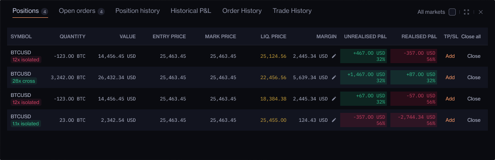
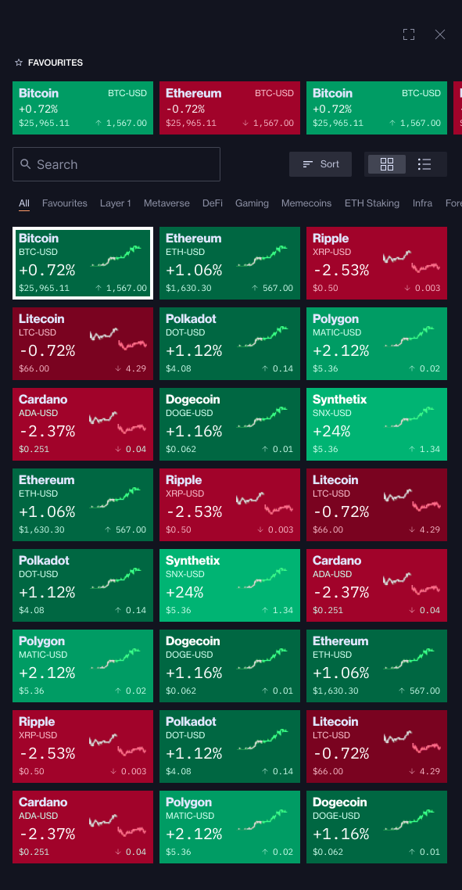
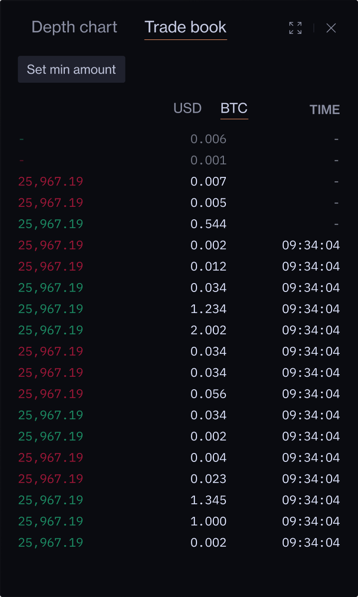

## Simple Summary

This XIP proposes the integration of Synthetix Perps V3 on Base to support the implementation of perpetual contracts trading on Infinex. 

## Abstract

This XIP proposes the implementation of perpetual contracts trading on Infinex, through the integration of the Synthetix Perps V3 contracts. This will include integrating different types of orders such as market, limit, trigger, and conditional. This XIP will also address how onchain data will be collected alongside the necessary systems and architecture to facilitate perps trading.

## Motivation

Infinex is deeply committed to bridging the divide between decentralized finance (DeFi) and an intuitive user experience (UX) that is synonymous with centralized finance (CeFi). This proposal embodies that vision, seeking to harness the potential of perpetuals trading in catering to a vast and enthusiastic user base. By strategically integrating Synthetix V3, Infinex not only accesses a rich liquidity pool, but also allows the contributors to capitalize on the already proven infrastructure of Synthetix, negating the need to build from the ground up and expend additional resources.

## Specification

### Overview

Infinex seeks to expand the functionality of user accounts to seamlessly integrate and facilitate perpetual contracts trading with Synthetix V3 and Synthetix Perps V3.

Synthetix V3, the latest version of the Synthetix protocol, is engineered to support the creation of on-chain derivatives using a Collateralized Debt Position (CDP) mechanism. Central to V3 are "Pools," which amalgamate various collaterals for sUSD production, subsequently channeling it into derivative markets crucial for perpetual contracts trading. Perps V3 enhances the UX by introducing multi-collateral support, allowing any synth as collateral and native cross-margin capabilities. This enables a unified margin account across all markets, streamlining interactions between user accounts, the Synthetix protocol, and its smart contracts via a relayer.

Read more [here](https://docs.synthetix.io/v/v3/).

With the integration of Synthetix v3, this XIP now outlines the order types and features that are proposed to be developed that will underlie the Infinex perpetual contracts trading platform. 

**Note to reader**: All provided photos in this documentation are from early product development for this proposal and are subject to change.

### Trade execution

Infinex's trade execution protocol will be designed to prevent unauthorized access to user funds by necessitating user-signed messages for trade authentication, thereby ensuring that only the user can initiate transactions. The platform employs a browser key for transaction signing. This key is encrypted and housed in a cross-domain iFrame, also mitigating the risk of cross-site scripting attacks.

Infinex will implement the EIP-2771 standard (OpenZepplin) to enable users to sign a message instead of a transaction which verifies their intent to trade. A third-party “relayer” will then confirm the message as correctly signed before facilitating trades on behalf of the user, strictly adhering to the user’s directives without holding any discretionary power over the user’s assets. This process not only secures user intent verification but also relieves users from manual transaction signing, therefore facilitating a more seamless UX. Additionally, this relayer will also be responsible for paying transaction fees which allows users to easily interact with smart contracts without holding Ether.

### Order Types

Infinex proposes a variety of order types to cater to diverse trading needs. Each order will have specific interfaces that optimise for fluidity, information, and simplicity. 

This section will delve into the mechanics of offchain order placements, and specify how they seamlessly integrate with the Synthetix Perps V3 contracts.

*Market Orders* 

Market orders will be executed instantaneously through Synthetix V3. The order will be committed via the `commitOrder` function on the Synthetix PerpsMarketProxy contract. Then following a required time offset, the order will be settled by decentralized keepers.

*Limit Orders*

Limit orders will be integrated once Synthetix Perps V3 contracts natively accept limit orders.

*Trigger Orders* 

Trigger orders are a specialized type of order where a market order is executed once the price hits a previously set “trigger” price. 

In Infinex, trigger orders will be stored offchain. A centralized service will run which monitors the current price of the specified market. Once the trigger price is hit, a market order will be sent on-chain to be executed.

*Conditional Orders*

Conditional orders are a specialized type of order where a trigger order is placed only when certain conditions are met. This involves two main prices: the "trigger” price and the "order” price. Once the trigger price is reached, it activates the placement of a trigger order at the order price.

In Infinex, the trigger price and order price will be set manually by the user and stored offchain, while the resulting market order will be placed via Synthetix Perps V3 upon activation of the trigger order.

### Margin Modes

Infinex will implement the two main margin modes that traders are familiar with: Isolated Margin and Cross Margin.

*Isolated Margin*

Infinex will adopt an isolated margin framework where an initial margin is applied to a position which must be manually adjusted. Should liquidation occur, the margin allocated to that position will be fully depleted.

The platform’s structure allows for an isolated margin position that corresponds to a single Synthetix Perps V3 account (a one-to-one relationship), utilizing the total account margin exclusively for that position. Consequently, adjusting leverage involves directly managing the account margin: reduce leverage by increasing margin, increase leverage by removing margin.

*Cross Margin*

Infinex's cross margin mechanism will deploy the entire available balance of a Synthetix Perps V3 margin account to fulfill maintenance margin requirements, safeguarding against liquidation. In this system, a single account's total margin supports multiple positions in a one-to-many relationship. Yet, it is important to note that liquidation would result in the loss of all available balance linked to those positions.

Hence, cross margin positions all share a single leverage, calculated by:

\\[\texttt{crossLeverage} = \texttt{crossPositionsValue} / \texttt{crossAccountMarginValue}\\]

A key distinction of Infinex's approach versus typical centralized exchanges lies in its handling of leverage within cross margin positions. On Infinex, all positions within a cross margin setup will share the same leverage level. Consequently, if liquidation is triggered, it affects all positions because the Synthetix Perps V3 contracts mandate the liquidation of the entire cross margin account, not just individual positions.

### Data Layer **Specification**

Since Synthetix has no concept of positions in the Perps V3 contracts, in order to provide the UI/UX traders are familiar with, Infinex will aggregate on-chain data to calculate the corresponding position data.

*Value*

The value of a position is:

\\[\texttt{value} = |\texttt{size}| \times \texttt{markPrice}\\]

*Unrealized PnL*

The unrealized PnL of a position is the amount of profit a trader would receive from closing the position at that point in time.

\\[\texttt{unrealisedPnl} = \left(\texttt{pythPrice} \times \texttt{size} \right) - \left(\texttt{averageEntryPrice} \times \texttt{size}\right)\\]

*Realized PnL*

The realized PnL of a position is the amount of profit a trader has received from closing out all/some of the position.

Note: “prior” meaning before the closing of a trade. 

\\[\texttt{realisedPnl} = \left(\texttt{closingTradeFillPrice} \times \texttt{closingTradeSize} \right) - \left(\texttt{priorAverageEntryPrice} \times \texttt{priorSize}\right) + \texttt{accruedFunding}\\]

*Entry Price*

The entry price of a position is the average of the fill prices of trades which increase the absolute size of the position.

*Exit Price*

The exit price of a position is the average of the fill price of trades which decrease the absolute size of the position.

*Liquidation* 

The Synthetix Perps V3 contracts have no concept of liquidation price, hence Infinex will infer a liquidation price for UI/UX purposes. In the Synthetix PerpsV3 contracts, the condition for liquidation is when:

\\(\texttt{int}(\texttt{requiredMaintenanceMargin} + \texttt{liquidationReward}) > \texttt{availableMargin} \\)

Hence, we can solve for the index price in order to calculate the liquidation price of a position if all other market conditions remain same. This will be expanded on upon further community discussion.

### Markets

Infinex will offer all markets that the Synthetix Perps V3 contracts support. In order to ensure pricing consistency with the Synthetix Perps V3 contracts, pricing data for all markets is read from Pyth Network, a blockchain oracle for market data. 

### Depth Chart

Infinex's depth chart will be tailored to the unique structure of an automated market maker (AMM), which operates without a traditional order book found in centralized exchanges. Despite this difference, Infinex's depth chart will provide traders with a visual representation of the market's liquidity, mirroring the functionality of conventional depth charts. It informs users of the potential fill price for a given volume, also allowing users to gauge the maximum amount of volume and “liquidity” at various price levels.

The platform will incorporate Synthetix's skew-balancing mechanism. For instance, in a market leaning towards long positions, short trades will be rewarded, and the opposite is true for a short-skewed market. This mechanism can result in an artificial liquidity imbalance, resulting in a variance in available volume that can be executed at different price points between the buy and sell sides.

The provided hypothetical depth chart illustrates what a pronounced disparity in liquidity favoring the buy-side relative to the sell-side would look like. This is indicative of a short-skewed market, so short positions would incur a greater slippage and less favorable fill price compared to entering a long position where ample liquidity would mitigate such concerns.

### Tradebook

The Infinex tradebook will present a real-time visualization of all open orders and executed trades within the Synthetix network, capturing the three critical stages of a trade's lifecycle: Committed, Pre-wormhole Price, and Settled. This systematic depiction is engineered to provide traders with essential information, ensuring they are equipped with the most current market data with minimal latency.

*Committed*

A trader first submits their intent to trade by “committing” a trade to the Synthetix Perps V3 contract. This commitment will include the size delta, the desired market, and an acceptable price.

*Pre-wormhole Price*

In order to calculate the fill price of that trade, the Synthetix Perps V3 contracts uses the first wormhole-signed Pyth price update after a trade has been committed. By fetching this Pyth price before it is signed by wormhole, we can read the price several seconds faster than the Synthetix contract.

*Settled*

Decentralized keepers will be tasked with monitoring the blockchain for valid committed trades. Upon identifying a valid trade, they submit a wormhole-signed price to provide the fill price of the trade. Following the confirmation of this transaction, the trade status is updated to "settled."

The sequential progression of these trade stages is depicted in the accompanying illustration. Initially, committed trades display only the optimistic price. Subsequently, the pre-wormhole price is attached to the trade, and finally the trade reaches settlement, which will be marked by the corresponding block time.

### Account info

Will allow users a granular understanding of their margins and margin health.

*Equity*

Equity in Infinex accounts is a comprehensive measure of a trader's financial standing within the platform. It encompasses various elements, calculated as follows:

\\[\texttt{Equity} = \texttt{marginInPositions} + \texttt{currentAvailableBalance} + \texttt{unrealisedPnL}\\]

*Available balance*

The available balance represents the portion of a trader's account that is not tied up in margin and can be used for creating new positions or withdrawals. It's a crucial indicator of liquidity within an account. This balance is obtained through the `getAvailableMargin()` function on the Synthetix Perps Market V3 contracts.

*Margin Ratio*

Margin ratio indicates the robustness of a trade position against market fluctuations and potential liquidation scenarios. It is defined as the total margin required to keep all positions open, calculated using the following formula:

\\[\texttt{marginRatio} = \texttt{totalAssetValueOfAccount} / \texttt{usedMarginInPositions}\\]

Where:

- Total Asset Value of Account = All Margin in Positions + PnL of Opened Positions + Current Available Balance
- Used Margin in Positions is the margin that has been allocated for open positions. This can be retrieved using the `getAvailableMargin(accountId: uint128)` function.

A higher margin health ratio suggests a healthier account, with greater resilience against market downturns.

### Subaccounts of infinex

Infinex’s smart contract architecture will also enable multiple subaccounts under a single Infinex account to allow unique and diversified management of asset allocation.

## Rationale

The core rationale for adopting the Synthetix V3 perpetual contracts architecture within Infinex lies in leveraging a sophisticated collateralization system that enhances liquidity through pooled assets and multi-collateral support which is crucial for perps trading. 

The Infinex design philosophy centres on providing a secure, fluid trading experience, capitalizing on Synthetix V3's capabilities such as native cross-margining to ensure efficient capital allocation and risk diversification. Furthermore, by integrating a robust trade execution framework that emphasizes user autonomy via EIP-2771 and relayer systems, Infinex aims to reduce complexity and foster a responsive, user-centric platform. This integration underpins a priority on delivering an advanced, intuitive, and transparent trading experience, allowing users to effortlessly trade with minimal clicks and latency.

## Copyright

Copyright and related rights waived via [CC0](https://creativecommons.org/publicdomain/zero/1.0/).