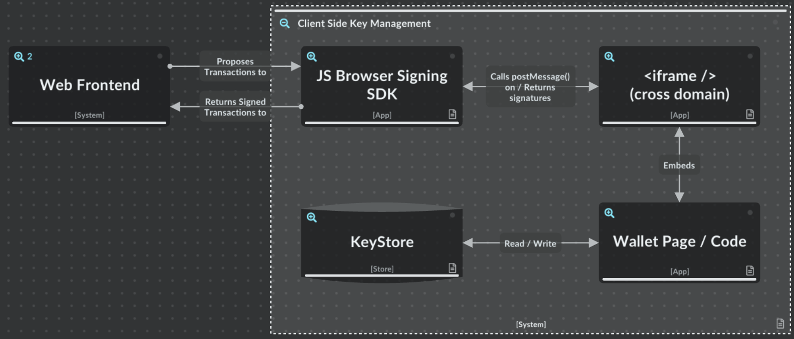

# Browser Key Storage Auxiliary File

Existing Ethereum private key storage mechanisms for browsers are oriented around decentralised mechanisms for users that understand DeFi, and who want to inspect each transaction before they sign with the key and the transaction is sent to the network. While asking for approval before every signature ensures that nothing happens without the user’s permission, it results in a “mash yes” attitude from users that don’t understand the technical details of the network, because they don’t have the knowledge to vet what’s being asked of them anyway. While this is the ultimate in decentralisation, it results in a poor user experience for these users, who are comparing against fully centralised solutions where they just click a few buttons and things happen.

Infinex is providing more centralised mechanisms around existing Synthetix DeFi solutions for users that wish to trust us, while providing Smart Contract guarantees and escape hatches for users that wish to moderate and / or control levels of trust that we are granted. 

As such, we would like to build a novel Ethereum private key storage mechanism with the following properties:

- All code built for the solution is Open Source, licensed under the MIT licence.
- The tool is packaged and deployed to NPM so that other builders in the DeFi space can leverage it in their own projects if they choose.
- The solution uses a cross-domain iframe architecture so that it can provide a “service within a service” separation that prevents frontend code from accessing the keys directly, while still allowing it to request signatures from the service.
- Keys are encrypted with the user’s email address as the password so that a scanner looking for private keys on the hard drive is unable to find them unless it knows the user’s email address for their Infinex login as well.
- Keys persist unless the user clears their browser application storage for the key storage domain. It is therefore imperative that all contracts that allow for interaction from these addresses provide a recovery mechanism using another more permanent key that allows the user to re-enrol.
- Private keys are generated with a cryptographically secure random number generator.
- The API used between the primary application and the key storage service worker is documented and uses the postMessage() browser API.
- There is an SDK that application authors can use to access keys using the API or alternative wallets as they choose which allows them to interact with the wallet with standard web3 signature calls.
- The SDK connects to standard Web3 library ethers, and therefore also useDapp() and other common Web3 technologies.
- Optionally, the Wallet Page / Code can verify a signature which is generated on the Infinex server side to ensure the transaction came from the service. This would make it impossible for an attacker who got cross site scripting access to the frontend but had not compromised the backend to be able to do anything at all with these keys, but it also means the server has to be involved in every transaction. This is probably overkill, but is an option.
- Once a transaction is signed using the API between the service worker and primary application code, the transaction is able to be broadcast to an Ethereum node using standard Web3 libraries and RPC calls.

## Diagram

